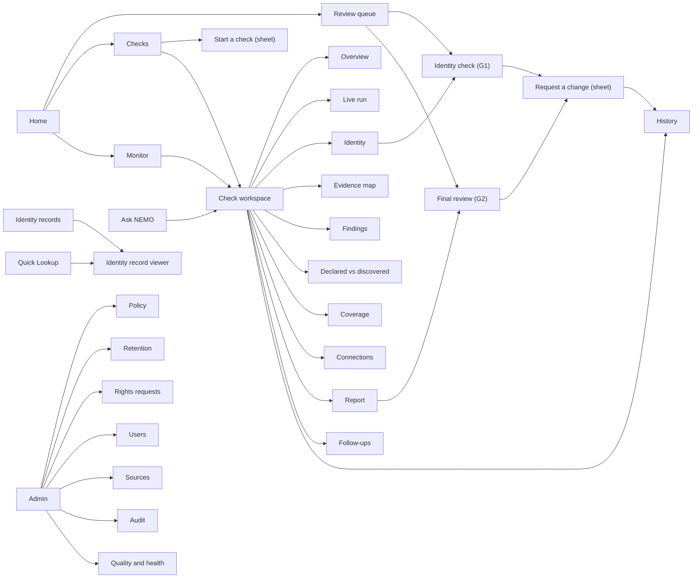

# Project NEMO: Frontend and User Interface Specification

## macOS desktop application, brand system and branded outputs

| Field | Value |
|---|---|
| Product | NEMO, background intelligence for private capital |
| Document type | Frontend and UI specification, engineering and design handoff |
| Companion to | `NEMO_PRD.md` v1.0 (the PRD). Requirement IDs such as `FR-084` or `PRV-020` refer to the PRD. |
| Platform | Native macOS application (macOS 14 Sonoma and later, Apple Silicon and Intel) |
| Version | 1.0 (build draft) |
| Date | 2026-10-08 |
| Audience | Frontend engineers (SwiftUI / AppKit), product designer, backend engineers (API contract), security engineer |
| Visual reference | The "NEMO design reference" canvas (published alongside this file) has nine artboards: 3 Brand system; 9.2 Identity record; 9.3 Crossover record; 6.6.1 Check overview; 6.8 Identity check; 9.1 Evidence map; 6.9 Final review; 10.3 Report cover; 10.3 Report summary page. Each artboard is named after the section of this document that specifies it. |

### How to read this document

- RFC 2119 keywords (**MUST**, **SHOULD**, **MAY**) apply.
- UI requirement IDs use these prefixes:

| Prefix | Class |
|---|---|
| `UI` | General UI behaviour |
| `VIZ` | Data visualisation |
| `BR` | Brand and printables |
| `UX-SEC` | Desktop privacy and security behaviour |
| `A11Y` | Accessibility |
| `API+` | API endpoints the UI needs that the PRD did not list (Section 16) |

- **Every control table** has a "Backend" column. It names one or more of:
  - an API endpoint (PRD Section 24, or an `API+` addition from Section 16 of this document);
  - a pipeline component (`C-xx` from PRD Section 12);
  - a PRD requirement ID.
- Wireframes are ASCII, for structure only. Visual treatment is defined by the tokens in Section 3 and by the design canvas.

---

## 1. Product surface summary

NEMO's backend is a multi-agent pipeline. The desktop app is where people:
1. start checks;
2. watch them run;
3. approve the identity fingerprint (gate G1);
4. read and question the evidence;
5. review and correct the final report (gate G2);
6. look up identity records;
7. ask questions of past cases;
8. govern the system.

| Persona | Primary surfaces | Secondary surfaces |
|---|---|---|
| Deal analyst | Home, Cases, Case workspace (all tabs), Identity check, Final review, Ask NEMO | Identity records, Monitor |
| Compliance officer / MLRO | Review queue, Final review (second reviewer), Monitor, Admin: policy, retention, rights requests, legal holds | Audit log, Playbook approvals |
| Senior reviewer | Review queue (escalations), Final review | Case History |
| Investment committee member | Identity records, Report viewer (read-only), Ask NEMO | None |
| Platform admin / security | Admin: users and roles, sources, keys, audit, model health | Playbook |

- **UI-001** A person sees only the sidebar sections their role allows. Hidden sections are absent, not greyed out (Section 4.2).

---

## 2. Application type and platform

### 2.1 Decision

NEMO ships as a **native macOS application** built with **SwiftUI**, with **AppKit** used where SwiftUI is not yet sufficient (large tables, text views with custom annotation, window-level security settings).

| Choice | Decision | Rationale |
|---|---|---|
| UI framework | SwiftUI (Observation framework), AppKit bridges via `NSViewRepresentable` | Native look, accessibility for free, small footprint, works with macOS security features (Keychain, Touch ID, screen-capture exclusion) |
| Minimum OS | macOS 14 Sonoma | Observation, `Inspector`, modern `Table`, `TipKit`, SwiftData-era APIs |
| Graph rendering | **Embedded, offline WKWebView** running a bundled WebGL graph renderer (Sigma.js with Graphology for layout), behind a typed Swift bridge | Knowledge graphs reach thousands of nodes; mature WebGL layout libraries handle this; native alternatives are less proven at this scale. The web view never loads remote content (UX-SEC-020). |
| Other charts | Swift Charts plus SwiftUI `Canvas` for custom marks | Native, accessible, matches type and colour tokens |
| PDF viewing | PDFKit | Native, supports annotation overlays for evidence highlighting |
| Local storage | GRDB on SQLCipher (encrypted SQLite); no SwiftData for sensitive data | Field-level control, encryption key in Keychain |
| Networking | `URLSession` with HTTP/2; server-sent events (SSE) or WebSocket for live case events | Live run view needs streaming |
| Auth | SSO via `ASWebAuthenticationSession` (OIDC with PKCE); tokens in Keychain; Touch ID re-authentication for sensitive actions | Enterprise SSO with MFA (SEC-005) |
| Distribution | Developer ID signed, notarised, hardened runtime, App Sandbox; delivered via the firm's MDM with a managed configuration profile | Enterprise deployment; server URL and policy set by MDM |
| Updates | Sparkle (EdDSA-signed appcast) or MDM-pushed packages; app refuses to run below the minimum version the server advertises | Security patches must land |

### 2.2 Windows and scenes

| Scene | Type | Opened by | Purpose |
|---|---|---|---|
| **Main window** | `WindowGroup`, multiple allowed | Launch, ⌘N (new window) | Sidebar + list + detail + inspector. The primary workspace. |
| **Case window** | `WindowGroup(for: CaseID.self)` | Double-click a case, "Open in new window" (⌥⌘O) | One case in its own window, for side-by-side work |
| **Identity record viewer** | `WindowGroup(for: DigitalID.self)` | Any Digital ID chip, Quick Lookup result | Shows the branded record (Section 9.2) with version history |
| **Report viewer** | `WindowGroup(for: ReportVersionID.self)` | "Open report" | Full-page PDFKit view of the branded report |
| **Source viewer** | `WindowGroup(for: SourceID.self)` | Any evidence citation | Sandboxed view of the original source with the cited span highlighted |
| **Quick Lookup panel** | Floating `NSPanel` (non-activating) | Global shortcut ⌃⌥Space (configurable), menu bar extra | Spotlight-style lookup of identity records by name or identifier |
| **Menu bar extra** | `MenuBarExtra` | Always present when enabled | Review queue count, monitor alerts, Quick Lookup |
| **Settings** | `Settings` scene | ⌘, | Per-user preferences (Section 6.16) |
| **About / Diagnostics** | Standard | NEMO menu | Version, server, policy version, diagnostics export (no personal data) |

- **UI-010** All windows except Quick Lookup and Settings MUST have screen-capture protection enabled by default (UX-SEC-010).
- **UI-011** The app restores open windows and selected tabs on relaunch, but **never restores revealed (unmasked) values** (UX-SEC-003).

### 2.3 Connectivity and offline behaviour

| State | Behaviour |
|---|---|
| Online | Full functionality; live updates over the event stream |
| Degraded (event stream down) | Banner: "Live updates paused. Data refreshes every 30 seconds." Fall back to polling. |
| Offline | Read-only access to cases opened in the last 7 days from the encrypted local cache, with a persistent banner: "Offline. You're viewing a saved copy from {time}. Changes are disabled." All actions that write (reviews, change requests, case creation) are disabled. |
| Server reports app version too old | Blocking sheet: "Update NEMO to continue. Your organisation requires version {x} or later." Button: "Update now". |

- **UI-012** Offline copies exclude: source documents, revealed identifiers, reviewer-only appendices. They expire after 7 days or on sign-out, whichever comes first (UX-SEC-030).

---

## 3. Brand system

The full visual sheet is on the design canvas, artboard **"3 Brand system"**.

### 3.1 Concept

**A hydrographic survey of a person.** NEMO borrows the visual language of two professional crafts:

| Vernacular | What NEMO takes from it | Where it appears |
|---|---|---|
| **Nautical charts** | Depth soundings for how deep a check goes; hatching for unsurveyed water (coverage gaps); hazard marks for findings; magenta for things a navigator must note | Verdict system, coverage map, evidence map, case level badges |
| **Security printing** | Guilloche line patterns, microtext, machine-readable line, plate registration | Identity records, report covers, crossover record |

**Signature element: plate registration.** In printing, two plates in register produce a crisp image; out of register, the image doubles. NEMO draws the declared and discovered identities as two plates. Agreement prints crisp; disagreement slips out of register. This is used on the crossover record (Section 9.3) and is the one place the brand is allowed to be loud.

### 3.2 Name, mark and wordmark

- **Product name:** NEMO. In running text, always "NEMO" (all capitals, because it is a name, not a label). Never "Nemo", never "N.E.M.O.".
- **Mark: the sounding.** Three nested, slightly irregular closed depth contours, as drawn around a seamount on a chart, tightening toward the upper right. A solid Chart magenta point sits at the deepest spot: "the thing found". The nested contours also read as a fingerprint whorl, which suits a product that builds identity fingerprints. Built on a 24-unit grid; contour strokes are 1.5 units; the point is 2.8 units in diameter. (Open concentric arcs were rejected because they read as a Wi-Fi or RSS symbol.)
- **Wordmark:** lowercase `nemo` set in Archivo Expanded (width 125, weight 800), in Sounding ink (or Survey white on dark). Tracking 0. The magenta point lives only in the mark, never in the letters. Minimum size 14 px / 4 mm in height.
- **Lockups:**
  - horizontal: mark + wordmark;
  - stacked: mark above wordmark;
  - mark only, for the app icon and favicon-sized uses.
- **Clear space:** the height of the `n` on all sides.
- **App icon (macOS):** a rounded-square (Apple icon grid) in Sounding ink with the mark in Survey white and the magenta point. A faint guilloche band crosses the lower third. Ships in all required sizes, plus a dark-mode variant and a monochrome menu bar template image (mark only, no magenta).

- **BR-001** The mark and wordmark MUST NOT be recoloured, outlined, rotated, given effects, or placed on photographs.
- **BR-002** The magenta point is the only place Chart magenta appears in the logo. On single-colour reproduction (fax, black-and-white print, engraving), the point becomes solid ink.

### 3.3 Colour tokens

All colours are defined as named tokens in an asset catalogue with light and dark appearances. Code MUST reference tokens, never raw hex values.

**Core palette**

| Token | Light | Dark | Role |
|---|---|---|---|
| `surveyWhite` | #F7F9F9 | #0E1A21 | Window background, print paper tint |
| `sheet` | #FFFFFF | #142530 | Raised surfaces: inspector, popovers, cards that are genuinely objects (identity records) |
| `soundingInk` | #12222C | #E6EEF0 | Primary text, the mark |
| `inkSecondary` | #4A5B66 | #A9BAC2 | Secondary text |
| `inkTertiary` | #7D8C95 | #6F8590 | Placeholder, disabled |
| `shoal` | #D3E4EA | #1D3440 | Selection fill, graph depth rings, subtle fills |
| `fathom` | #2D5F73 | #7FB3C6 | Links, graph edges, secondary emphasis, guilloche lines |
| `chartMagenta` | #B4196E | #E05AA5 | **Needs human attention**: pending reviews, disputed A/B results, unresolved items. Also the logo point. |
| `rule` | #D9E1E4 | #233A46 | Hairlines and separators |

- **UI-020** `chartMagenta` has exactly one meaning inside the app: *a person needs to look at this*. It MUST NOT be used for decoration, primary buttons, or brand emphasis in the UI. Primary buttons use the system accent colour (which an organisation MAY set to `fathom` via MDM).

**Verdict palette** (each colour is always paired with a glyph and, for coverage, a pattern)

| Verdict | Plain label in UI | Token | Light | Dark | Glyph | Pattern |
|---|---|---|---|---|---|---|
| `CLEAR` | Clear | `verdictClear` | #1F7A5C | #4CC59A | Filled circle | Solid |
| `CONCERNS` | Concerns | `verdictConcerns` | #A35F00 | #F0A93B | Open triangle | Solid |
| `RED_FLAG` | Red flag | `verdictRedFlag` | #C2342B | #F2766B | Filled diamond | Solid |
| `INSUFFICIENT_COVERAGE` | Not enough coverage | `verdictUnsurveyed` | #6B7A84 | #8FA1AB | Open square | Diagonal hatching (unsurveyed water) |
| `STOP` | Stopped: compliance review | `verdictStop` | #12222C fill, #C2342B ring | #E6EEF0 fill, #F2766B ring | Filled octagon | Solid |

- **A11Y-001** Every verdict text and glyph colour MUST reach 4.5:1 contrast against `surveyWhite` and `sheet` (verified in the token test suite). Glyph + label always appear together; colour never carries meaning alone.

**Severity palette** (S1 most severe, matching PRD Section 8.1)

| Severity | Token | Light | Dark | Mark |
|---|---|---|---|---|
| S1 Fraud / laundering | `sev1` | #9E1F1A | #F2766B | Five filled sounding bars |
| S2 Default / removal / forgery | `sev2` | #C2342B | #F28B7F | Four bars |
| S3 Conduct / non-disclosure | `sev3` | #A35F00 | #F0A93B | Three bars |
| S4 Commercial dispute | `sev4` | #5E6E78 | #A9BAC2 | Two bars |
| S5 Petty | `sev5` | #8D9AA2 | #7D8C95 | One bar |

The severity mark is a short vertical stack of five bars; filled bars equal `6 − level`. It reads like a depth gauge and is legible in monochrome print.

**Source tier marks** (PRD Section 7.6)

| Tier | Mark | Meaning shown on hover |
|---|---|---|
| T1 | Solid square, `soundingInk` | "Official record (adjudicated or registry)" |
| T2 | Half-filled square | "Official, not yet decided (for example a pending case)" |
| T3 | Open square with inner dot | "Independent professional source" |
| T4 | Open square | "Self-reported (CV, deck, LinkedIn, website)" |
| T5 | Dashed open square | "Anonymous or crowd source. A lead, not evidence." |

### 3.4 Typography

| Role | Typeface | Where | Notes |
|---|---|---|---|
| App UI | **SF Pro** (system) | Every native screen | Use the macOS text styles (`.body` 13 pt, `.callout` 12 pt, `.caption` 10 pt, `.title3` 15 pt, `.title2` 17 pt, `.title` 22 pt, `.largeTitle` 26 pt). Numbers in scores, dates and tables use `.monospacedDigit()`. |
| Brand display | **Archivo Expanded** (Archivo, wdth 125), weights 600 and 800 | Wordmark, app empty-state headlines, identity record headers, report covers and section heads | Bundled; licensed under the SIL Open Font License |
| Print text | **Source Serif 4**, weights 400 and 600, with italic | Report body, letters, printables | 10.5 pt / 15 pt leading on A4; line length about 70 characters. **Italic is reserved for verbatim text quoted from a source** (the hydrographic convention: water is labelled in italic). |
| Machine line | **B612 Mono** | Digital ID number, machine-readable line, signature key ID on records and printables | Only these uses. Never for UI labels. |

- **UI-021** No all-capitals labels anywhere in the UI or printables, except the NEMO name and the machine-readable line on identity records.
- **UI-022** Headings are sentence case. No decorative eyebrow text above headings.

### 3.5 Iconography

- **System:** SF Symbols for standard actions (share, print, search, filter, sidebar).
- **NEMO symbol set:** custom symbols drawn on the SF Symbols template grid (three weights, three scales) for domain concepts:

| Symbol | Concept |
|---|---|
| `nemo.ping` | The mark; used for "Start check" |
| `nemo.person` | Subject / person node |
| `nemo.org` | Organisation node |
| `nemo.event` | Event (case, order, article cluster) |
| `nemo.claim` | Claim (a speech bubble with a tick-slot) |
| `nemo.source` | Source document |
| `nemo.span` | Evidence span (a highlighted line) |
| `nemo.plates` | Crossover (two offset rectangles) |
| `nemo.lens.ab` | Double-blind pair (two half-circles) |
| `nemo.gate` | Human review gate |
| `nemo.depth.1` / `.2` / `.3` | Case levels L1 to L3 (one to three sounding lines) |
| `nemo.unsurveyed` | Coverage gap (hatched square) |
| `nemo.stale` | Stale node (dotted outline) |
| `nemo.shred` | Erasure |

### 3.6 Motion

- **UI-030** Motion only answers an action or reports live progress. No ambient animation.
- Permitted motion:

| Motion | Where | Spec |
|---|---|---|
| Ping | A new finding or alert arrives in the live run view or the menu bar | One sonar ring expands from the item's glyph and fades, 600 ms, once |
| Plate slip | Opening the crossover record | Plates start registered, then disagreeing fields slip to their offset, 400 ms ease-out. Shows that the offset *is* the difference. |
| Graph settle | Layout changes in the evidence map | Force layout runs at most 800 ms, then freezes |
| Sheet / inspector | Standard macOS transitions | System default |

- **A11Y-002** With "Reduce motion" on, the ping is replaced by a static ring, plate slip renders the final state immediately, and the graph lays out without animation.

### 3.7 Voice and terminology

The UI uses plain words for what people do. Backend terms appear only in the History tab, diagnostics and admin screens.

| Backend term (PRD) | UI term | Example use |
|---|---|---|
| Case | Check | "Start a check", "3 checks need you" |
| Case level L1 / L2 / L3 | Depth: Light, Standard, Enhanced | Badge "Standard depth" |
| Gate G1 | Identity check | "Review identity" |
| Gate G2 | Final review | "Start final review" |
| Change Request (CR) | Requested change | Button "Request a change"; toast "Change requested" |
| Redo-er Agent | (not named) | Progress: "Updating 3 findings after your change" |
| Fingerprint | Identity details | "Approve identity details" |
| DID-D / DID-S / DID-V | Declared identity / Discovered identity / Identity record | "Open identity record" |
| Crossover | Declared vs discovered | Tab "Declared vs discovered" |
| Disclosure Degree (DD) | Disclosure | "Disclosed 67% of what we found" |
| Trust metric (TM) | Consistency score | "Consistency 0.58 (low)" |
| Evidence item / span | Evidence | "4 pieces of evidence" |
| Event | Matter | "Labour case, Gurugram, 2025" |
| Finding | Finding | "2 findings" |
| Coverage / retrieval state | Coverage | "Searched, nothing found" |
| Red Team (recall / report modes) | Independent recheck | "Independent recheck found 1 item the first search missed" |
| Resolve loop | Follow-up | "Following up on 4 items" |
| Probe | Follow-up task for a person | "Ask for exit documents" |
| Playbook | Playbook | "Playbook suggestion" |
| Modif. Agent | (not named) | "Search index updated" |
| Hard stop | Stopped for compliance review | Banner text |
| Stale | Out of date, updating | Node tooltip |

**Copy rules**
- An action keeps its name through the whole flow: "Approve identity details" produces the toast "Identity details approved".
- Errors say what happened and what to do, without apologising. Example: "The district court portal for Pune didn't respond. NEMO will retry in 10 minutes, or you can request a manual search."
- Empty states invite an action. Example, empty Cases list: "No checks yet. Start a check to vet a founder, manager or investor." Button: "Start a check".
- Allegations are always worded as allegations: "Named as respondent in a pending case", never "Committed".

---

## 4. Information architecture and navigation

### 4.1 Main window layout

```
┌──────────────────────────────────────────────────────────────────────────────────────────┐
│ ● ● ●   [◧]  Rahul Sharma [Standard depth]   ▸ Identity ▸ Search ▸ Assess ▸ Report ▸ ✓   │  toolbar
│                                              [🔍 Search ⌘K]  [Request a change] [⋯] [◨] │
├──────────────┬───────────────────┬─────────────────────────────────────────┬─────────────┤
│ Sidebar      │ List              │ Detail                                  │ Inspector   │
│              │                   │                                         │             │
│ Home         │ Checks            │ [Overview][Live run][Identity]          │ Selected    │
│ Review queue │ ─────────────     │ [Evidence map][Findings][Declared vs    │ item:       │
│ Checks       │ ◆ R. Sharma   L2  │  discovered][Coverage][Connections]     │ details,    │
│ Monitor      │ ● A. Iyer     L1  │ [Report][Follow-ups][History]           │ evidence,   │
│ Identity     │ △ M. Khan     L3  │                                         │ actions     │
│  records     │ ...               │  (tab content)                          │             │
│ Ask NEMO     │                   │                                         │             │
│ Playbook     │                   │                                         │             │
│ Admin        │                   │                                         │             │
│              │                   │                                         │             │
│ ⊙ Saigourav  │                   │                                         │             │
└──────────────┴───────────────────┴─────────────────────────────────────────┴─────────────┘
```

| Region | Width | Behaviour |
|---|---|---|
| Sidebar | 200 to 260 pt, collapsible (⌃⌘S) | Sections in Section 4.2; badges show counts needing attention (magenta) |
| List | 280 to 360 pt, collapsible | Context list for the selected section |
| Detail | Flexible, min 640 pt | Tabbed workspace for the selected item |
| Inspector | 300 to 380 pt, toggle ⌥⌘I | Context for the item selected inside the detail view: a node, a finding, a source, a claim |

### 4.2 Sidebar sections

| Section | Visible to | Badge | Opens |
|---|---|---|---|
| **Home** | All | None | Section 6.2 |
| **Review queue** | Analyst, compliance, senior reviewer | Count of reviews assigned to me (magenta) | Section 6.7 |
| **Checks** | Analyst, compliance, senior reviewer | Count of my checks with unresolved items | Section 6.3 |
| **Monitor** | Analyst, compliance | Unread alerts (magenta) | Section 6.11 |
| **Identity records** | All except platform admin (by default) | None | Section 6.10 |
| **Ask NEMO** | All with case access | None | Section 6.12 |
| **Playbook** | Compliance, platform admin; read-only for analysts | Pending approvals (magenta) | Section 6.13 |
| **Admin** | Compliance (policy, retention, rights), platform admin (users, sources, keys, health) | Open rights requests, source outages | Section 6.14 |
| User menu (bottom) | All | None | Profile, role, sign out, lock now |

### 4.3 Navigation map



### 4.4 Menu bar menus

Every menu item and its backend mapping. Items are disabled (not hidden) when not applicable in the current context, per macOS convention.

**NEMO menu**

| Item | Shortcut | Backend |
|---|---|---|
| About NEMO | None | `GET /v1/meta` (API+): server, policy and config versions |
| Settings… | ⌘, | Local, plus `GET/PUT /v1/me/preferences` (API+) |
| Lock NEMO | ⇧⌘L | Local: clears revealed values, requires Touch ID or password to resume (UX-SEC-004) |
| Sign out | None | `POST /v1/auth/logout` (API+); wipes local cache (UX-SEC-030) |
| Hide / Quit | Standard | Local |

**File menu**

| Item | Shortcut | Backend |
|---|---|---|
| Start a check… | ⌘N | Opens Section 6.4; `POST /v1/cases` |
| Start a batch… | ⇧⌘N | Opens Section 6.5; `POST /v1/cases/batch` |
| New window | ⌥⌘N | Local |
| Open in new window | ⌥⌘O | Local |
| Add documents to check… | ⌘O (in a check) | `POST /v1/cases/{id}/documents` |
| Export… (submenu: Report PDF, Identity record PDF, Identity record PNG, Evidence map PDF, Reference call sheet PDF, Crossover sheet PDF, Findings CSV) | ⌘E for the default export of the current tab | `POST /v1/exports` (API+), PRV-051 watermarking; Section 10 |
| Print… | ⌘P | Prints the server-rendered branded PDF for the current tab; `POST /v1/exports` with `purpose=print` |
| Close window | ⌘W | Local |

**Edit menu**: standard Undo, Redo, Cut, Copy, Paste, Select all, Find (⌘F in the current view). Plus:

| Item | Shortcut | Backend |
|---|---|---|
| Copy Digital ID | ⇧⌘C (when a record is selected) | Local; copies the public ID only, never identifiers |
| Copy link to item | ⌥⌘C | Local; `nemo://` deep link (Section 13.5) |

**View menu**

| Item | Shortcut | Backend |
|---|---|---|
| Show / hide sidebar | ⌃⌘S | Local |
| Show / hide inspector | ⌥⌘I | Local |
| Tabs: Overview ... History | ⌘1 to ⌘9, ⌘0 for History | Local |
| Evidence map layout: Soundings / Network / Timeline / Ownership | ⌥1 to ⌥4 (in Evidence map) | Local layout over `GET /v1/cases/{id}/graph` (API+) |
| As of date… | ⌘T (in a check) | Re-queries graph and findings with `as_of` (FR-123) |
| Show what NEMO knew at… | ⇧⌘T | `recorded_at` query (bitemporal, PRD 15.2) |
| Show reviewer-only items | ⌥⌘R (role-gated) | Requests `access_label=REVIEWER_ONLY` items |
| Enter full screen | ⌃⌘F | Local |

**Check menu** (enabled when a check is selected)

| Item | Shortcut | Backend |
|---|---|---|
| Review identity details | ⌘⇧1 | Opens Section 6.8; gate G1 |
| Start final review | ⌘⇧2 | Opens Section 6.9; gate G2 |
| Request a change… | ⌘R | Opens Section 6.9.3; `POST /v1/cases/{id}/change-requests` |
| Add a lead… | ⌘L | CR type `NEW_LEAD` |
| Request documents from subject… | None | CR type `REQUEST_DOCS` |
| Change depth… | None | CR type `SCOPE_CHANGE` (FR-080: lowering needs compliance approval) |
| Record subject response… | None | CR type `SUBJECT_RESPONSE` |
| Pause check / Resume check | None | `POST /v1/cases/{id}/pause`, `/resume` (API+) |
| Withdraw check… | None | `POST /v1/cases/{id}/withdraw` (API+); starts retention timer (PRV-040) |
| Open identity record | ⌘I | `GET /v1/ids/{digital_id}` |
| Open report | ⌘⇧R | `GET /v1/cases/{id}/reports/{version}` |

**Review menu**

| Item | Shortcut | Backend |
|---|---|---|
| Next item needing review | ⌘] | Local navigation over `GET /v1/reviews?assignee=me` (API+) |
| Previous item | ⌘[ | Local |
| Open source for selected finding | ⌘↩ | Opens Source viewer; logs `source.viewed` audit event (HR-011) |
| Approve | ⌘⇧A | `POST /v1/cases/{id}/reviews/{gate}` with `approve`; disabled until preconditions are met (Section 6.9) |

**Window** and **Help** menus: standard, plus Help → "NEMO user guide", "Keyboard shortcuts" (⌘/), "Report a problem" (diagnostics bundle without personal data, `POST /v1/support/diagnostics`, API+).

### 4.5 Global search (⌘K)

A command palette over the main window.

| Result group | Matches on | Backend |
|---|---|---|
| Checks | Subject name, alias, case ID | `GET /v1/search?q=` (API+), permission-filtered server side |
| Identity records | Name, Digital ID | Same |
| Commands | Menu commands by name | Local |
| Findings in current check | Text | Local index of loaded findings |

- **UX-SEC-001** Search by **identifier** (PAN, passport, DIN) is not done in ⌘K. It is only done in Quick Lookup's "Look up by identifier" mode (Section 6.10.3), which sends the value once over TLS for server-side HMAC and never stores it locally (OUT-012).

---

## 5. Shared components

These components are reused across screens. Each lists its data source.

### 5.1 Stage tracker ("descent bar")

A horizontal track in the toolbar showing case progress as soundings descending left to right:

```
 Scope ─ Identity ─ Identity check ─ Search ─ Assess ─ Follow-up ─ Report ─ Final review ─ Published
   ●        ●            ◉ (you)         ○        ○         ○          ○          ○              ○
```

| Element | Meaning | Source |
|---|---|---|
| Filled dot | Stage complete | `case.state_changed` events; `GET /v1/cases/{id}` |
| Ring with magenta fill | Waiting for a person (gate G1 or G2, or a follow-up task) | Same |
| Pulsing ring (static if Reduce motion) | Running | Same |
| Hatched dot | Stage skipped or cut short (budget, short-circuit FR-086) | Same |
| Octagon | Stopped (hard stop FR-060) | Same |

Clicking a stage jumps to the tab where that stage is visible (for example "Search" opens Live run).

### 5.2 Verdict badge

`[glyph] Label` in the verdict colour, on a 10% tint of the same colour. Two sizes: compact (list rows) and full (overview board). The full badge adds the point score and interval: `Red flag  0.46 (0.38 to 0.55)`.

### 5.3 Score range bar

A horizontal bar from 0 to 1 with the verdict band boundaries (0.10, 0.40) drawn as tick lines. The interval (`Q_low` to `Q_high'`) is drawn as a band; the point score is a short vertical stroke. The coverage-driven part of the upper bound is drawn hatched, showing how much of the uncertainty comes from unsearched sources (PRD 8.5).

```
0 ────┬──────────────────┬───────────────── 1
      0.10               0.40
                    ████████▓▓▓▓
                         │
              point 0.46, interval 0.38 to 0.55 (▓ = from coverage gaps)
```

### 5.4 Evidence chip

An inline token: `[tier mark] Source name, date` with the retrieval date on hover. Click opens the inspector; ⌘-click opens the Source viewer. Source: `EvidenceSpan` and `Source` nodes.

### 5.5 Severity mark

The five-bar depth gauge (Section 3.3). Always paired with the severity label on first use in a view.

### 5.6 Masked identifier field

```
PAN   XXXXX1234X   [👁 Reveal]
```

- Default display: masked by the server (`PRV-050`).
- "Reveal" requires Touch ID or password, plus a reason picked from a list ("Verifying against document", "Responding to subject", "Other: …"). The reason and the reveal are audit-logged.
- Revealed values auto-mask after 30 seconds, on window blur, or on lock.
- Backend: `POST /v1/vault/reveal` (API+), which calls vault `detokenize` under role policy (PRD 15.5).
- **UX-SEC-002** Revealed values MUST NOT be written to the local cache, logs, crash reports, pasteboard history, or state restoration.

### 5.7 A/B agreement indicator

Shows the double-blind result for an attribute, match or verdict:

| State | Visual | Meaning |
|---|---|---|
| Agreed | `nemo.lens.ab` closed, ink | Both judges agreed |
| Disputed | `nemo.lens.ab` split, magenta | Judges disagreed; a person needs to decide |
| Third judge decided | Split lens with a small "3" | Tie-break by judge C (DB-5) |
| Single judge | One half-circle | Outside double-blind scope (DB-7) |

Hover shows both judges' values and rationales side by side (reviewer roles only). Source: `MatchDecision` / `Classification` nodes.

### 5.8 Retrieval state mark

| State | Mark | Label |
|---|---|---|
| `FOUND_RETRIEVED` | Solid dot | "Found and read" |
| `FOUND_NOT_RETRIEVED` | Dot with a gap | "Found, not yet read" |
| `NOT_FOUND` | Small open circle | "Searched, nothing found" |
| `PARTIAL` | Half-hatched circle | "Partly searched" (with completeness %) |
| `UNREACHABLE` | Open circle with slash | "Couldn't search" |
| `OUT_OF_SCOPE` | Dash | "Not in scope" |

### 5.9 Citation marker

Superscript numbered markers in report and finding text. Hover shows the cited span in italic serif with source and tier. Click opens the Source viewer at the span.

### 5.10 Source viewer

A separate window (Section 2.2) that shows the original source:

| Source type | Rendering |
|---|---|
| PDF (court order, filing) | PDFKit with the cited span highlighted (yellow-free: a `shoal` fill with a `fathom` left rule) |
| Web page | A **sanitised server-side snapshot** (HTML stripped of scripts and remote resources, rendered in a locked WKWebView) or a server-rendered image; never the live page (UX-SEC-020) |
| Image / scan | Image view with OCR overlay and the span box drawn |
| Registry record | Structured field view |

The header shows: source name, tier mark, platform, retrieved date, content hash (short), and an "Open original link" button. That button asks for confirmation before opening an external browser: "This opens the live page in your browser. The site may see your visit." This matters because of query-leakage concerns (PRV-020).

- **HR-011 link:** opening the source viewer for a finding records the audit event that unlocks final approval.

### 5.11 Inspector

Context panel for whatever is selected in the detail area:

| Selection | Inspector shows |
|---|---|
| Graph node (person / org) | Name, type, role in case, identifiers (masked), linked findings, evidence chips, "Trace lineage" button |
| Event / finding | Severity, status, role, legal status, SoE, m, RC with interval, A/B indicator, evidence list, "Explain this score" (Section 9.5), "Request a change" |
| Claim | Claim text, origin, status (verified / contradicted / unverified), supporting and contradicting evidence |
| Source | Tier, platform, retrieval state, TTL and freshness, hash, which findings cite it |
| Coverage cell | Source, state, completeness, error class, "Retry" or "Request manual search" |

### 5.12 Toasts, banners and alerts

| Type | Use | Example |
|---|---|---|
| Toast (bottom, auto-dismiss 4 s) | Confirmation of an action | "Change requested" |
| Banner (top of detail, persistent) | Case-wide state | "Stopped for compliance review. A sanctions list match was confirmed." (octagon, STOP colour) |
| Alert (modal) | Destructive or irreversible actions | Withdraw check, erase subject data |
| macOS notification | Off-window events | "Final review ready: Rahul Sharma" |

### 5.13 Empty, loading and error states

- **Loading:** skeleton rows in `shoal` with no shimmer; stage tracker shows live progress.
- **Empty:** one sentence plus one action (copy rules, Section 3.7).
- **Error:** what failed, impact, and the next step, plus a "Copy error ID" button for support (the error ID never contains personal data).

---

## 6. Screens

Each screen lists its purpose, layout, every control with its backend mapping, its states and who can use it.

### 6.1 Sign in and unlock

**Purpose:** authenticate with the firm's SSO; unlock after idle.

```
┌───────────────────────────────────────────┐
│                                           │
│            (( ●  nemo                     │
│                                           │
│     Background intelligence for           │
│     private capital                       │
│                                           │
│     [ Sign in with Acme Capital SSO ]     │
│                                           │
│     Server: nemo.acmecap.internal         │
│     Policy 2026.10.0                      │
└───────────────────────────────────────────┘
```

| Control | Action | Backend |
|---|---|---|
| Sign in with {org} SSO | Opens `ASWebAuthenticationSession` to the IdP (OIDC + PKCE); stores tokens in Keychain | `GET /v1/auth/authorize`, `POST /v1/auth/token` (API+); SEC-005 |
| Server line | Shows the MDM-configured server; not editable unless MDM allows | MDM managed config |
| Unlock (after idle or ⇧⌘L) | Touch ID or account password | Local Keychain-protected key; refreshes tokens if expired |

- **UX-SEC-004** Idle lock after 10 minutes (MDM-configurable, maximum 30). Locking blurs all windows, clears revealed values and pauses local rendering of sensitive views.

### 6.2 Home

**Purpose:** what needs me today.

```
┌──────────────────────────────────────────────────────────────────────┐
│ Good afternoon, Saigourav                                            │
│                                                                      │
│ Needs you                                         [See review queue] │
│ ┌──────────────────────────────────────────────────────────────────┐ │
│ │ ◉ Identity check   Priya Nair        Standard   waiting 25 min   │ │
│ │ ◉ Final review     Rahul Sharma      Standard   2 disputed items │ │
│ │ ◉ Follow-up task   Ask for exit documents (R. Sharma)  due Fri   │ │
│ └──────────────────────────────────────────────────────────────────┘ │
│                                                                      │
│ Running now                                                          │
│  Arjun Mehta   Enhanced   Search  ▓▓▓▓▓▓░░░  Coverage 61%  2 findings│
│  Cohort W26    Light ×120 Assess  ▓▓▓▓▓▓▓▓░  98 clear, 4 need review │
│                                                                      │
│ Monitor alerts (3 new)                                    [Open all] │
│  ◆ New regulator order naming K. Bose              2 h ago           │
│  △ Pending case status changed: R. Sharma          yesterday         │
│                                                                      │
│ Recently viewed identity records                                     │
│  [NEMO-PER-7F3K-9Q2M-C] [NEMO-PER-2B8D-...] ...                      │
└──────────────────────────────────────────────────────────────────────┘
```

| Control | Action | Backend |
|---|---|---|
| "Needs you" rows | Open the gate or task directly | `GET /v1/reviews?assignee=me`, `GET /v1/tasks?assignee=me` (API+) |
| See review queue | Opens Section 6.7 | Local |
| "Running now" rows | Open the check's Live run tab | `GET /v1/cases?state=running&owner=me` (API+); live via event stream |
| Monitor alert rows | Open the alert in Monitor | `GET /v1/alerts?unread=true` (API+) |
| Identity record chips | Open the Identity record viewer | `GET /v1/ids/{digital_id}` |
| Start a check (toolbar, ⌘N) | Section 6.4 | `POST /v1/cases` |

**States:** first-run empty state shows a short "How NEMO works" strip (the seven stages as a static illustration) and the "Start a check" button.

### 6.3 Checks list

**Purpose:** find and triage checks.

**List columns** (AppKit-backed `Table`, sortable, column chooser):

| Column | Content | Source field |
|---|---|---|
| Subject | Name + subject type icon (founder, manager, LP, co-investor) | `Case.subject` |
| Depth | `nemo.depth.n` + Light / Standard / Enhanced | `Case.level` |
| Stage | Stage tracker mini (dots) | `Case.state` |
| Verdict summary | Worst verdict glyph + count of red flags | `Score` nodes |
| Coverage | Percentage + small hatched bar for the gap | `coverage_q` aggregate |
| Needs | Magenta count of open items needing a person | `OpenItem`, reviews |
| Owner | Analyst | `Case.owner` |
| Purpose | Seed investment, LP onboarding, etc. | `Case.purpose` |
| Updated | Relative time | `Case.updated_at` |

**Toolbar and filters**

| Control | Action | Backend |
|---|---|---|
| Start a check (⌘N) | Section 6.4 | `POST /v1/cases` |
| Start a batch (⇧⌘N) | Section 6.5 | `POST /v1/cases/batch` |
| Filter: Mine / Team / All (role-limited) | Scope | `GET /v1/cases?scope=` (API+) |
| Filter chips: Stage, Verdict, Depth, Purpose, Needs me, Has red flag, Stopped | Narrow the list | Query params on `GET /v1/cases` |
| Search field | Filter by subject name | Same, `q=` |
| Saved filters (sidebar sub-items) | Store a filter | `PUT /v1/me/saved-filters` (API+) |
| Context menu on row: Open, Open in new window, Copy Digital ID, Copy link, Pause, Resume, Withdraw… | As named | `POST /v1/cases/{id}/pause` etc. (API+) |

### 6.4 Start a check (sheet)

**Purpose:** create a case with everything the pipeline needs: subject, purpose, legal basis, documents, questionnaire, depth.

A five-step sheet with a step list on the left. This is a real sequence, so the steps are numbered.

```
┌───────────────────────────────────────────────────────────────────────┐
│ Start a check                                                         │
│ ┌──────────────┐ ┌──────────────────────────────────────────────────┐ │
│ │ 1 Subject    │ │ Who are you checking?                            │ │
│ │ 2 Purpose    │ │ Full name      [Rahul Kumar Sharma            ]  │ │
│ │ 3 Documents  │ │ Other names    [R. Sharma] [+ Add]               │ │
│ │ 4 Declaration│ │ Role           (•) Founder ( ) Manager ( ) LP    │ │
│ │ 5 Depth      │ │                ( ) Co-investor                   │ │
│ │              │ │ Organisation   [Acme Robotics Pvt Ltd        ]   │ │
│ │              │ │ Country        [India ▾]  City [Bengaluru    ]   │ │
│ │              │ │ Known IDs      DIN [________]  PAN [________]    │ │
│ │              │ │                (sent straight to the vault)      │ │
│ └──────────────┘ └──────────────────────────────────────────────────┘ │
│                                        [Cancel]  [Back]  [Continue]   │
└───────────────────────────────────────────────────────────────────────┘
```

| Step | Fields and controls | Backend |
|---|---|---|
| **1 Subject** | Full name; other names (tokens); role (founder / manager / LP / co-investor); organisation; country; city; known identifiers (DIN, PAN, passport, CIK, LEI). Identifier fields are secure text fields. | Identifiers go to `POST /v1/vault/tokenize` (API+) immediately on Continue and are replaced in the draft by tokens (PRV-011). Name and role go into the case draft. |
| **2 Purpose** | Purpose (seed / Series A investment, growth / buyout, LP onboarding, co-investor, accelerator intake, portfolio monitoring); deal context (free text, kept internal and never sent to sources, PRV-020); legal basis (picker filtered by purpose: consent, legitimate use, legal obligation); notice / consent evidence (attach file or "Consent captured in intake portal", with reference). | Policy Engine validates the purpose and basis: `POST /v1/cases/validate` (API+), C-03, PRV-001, PRV-003. If invalid, the step shows the policy reason inline and blocks Continue. |
| **3 Documents** | Drop zone for CV, pitch deck, KYC documents, other. Each file shows type detection, size, malware-scan status, and "Opened in a sealed sandbox" once parsed. | `POST /v1/cases/{id}/documents` (SEC-010, SEC-011). Scan status via event `document.scanned` (API+). |
| **4 Declaration** | Self-declaration questionnaire: send a secure link to the subject, upload a completed questionnaire, or skip (Light depth only, FR-070). Shows status: not sent / sent / completed. | `POST /v1/cases/{id}/questionnaire` (API+); FR-070, FR-071 |
| **5 Depth** | Shows the depth NEMO's policy assigned (Light / Standard / Enhanced), with the reasons ("Fintech sector", "Board seat"). The analyst can raise it; lowering requires a compliance approver (picker). Shows what the depth includes: questions, domains, associate checks, time budget, monitoring cadence. | `GET /v1/cases/{id}/plan` (API+); C-02, C-03, FR-080 |

| Footer control | Action | Backend |
|---|---|---|
| Cancel | Discard the draft; vault tokens for the draft are deleted | `DELETE /v1/cases/{id}/draft` (API+) |
| Back / Continue | Navigate steps; Continue validates the step | As per step |
| Start check (step 5) | Creates and starts the case; the sheet closes; the case opens on Live run | `POST /v1/cases/{id}/start` (API+); `case.created`, `case.scoped` |

### 6.5 Start a batch (sheet)

**Purpose:** UC1 accelerator cohorts (up to 500 subjects).

| Control | Action | Backend |
|---|---|---|
| Download template | CSV template with required columns | Static asset |
| Upload CSV | Parses rows client-side for format only; shows a row preview table with validation errors per row | `POST /v1/cases/batch/validate` (API+) |
| Purpose and legal basis (one for the batch) | Same as single check, step 2 | C-03 |
| Depth | Light by default; per-row overrides allowed upward | FR-080 |
| Start batch | Creates the batch | `POST /v1/cases/batch` |

**Batch progress view** (opens after start, also reachable from Checks list): a grid of small tiles, one per subject, each tinted by current verdict and stage. Tiles needing identity review are outlined in magenta. "Review identities in bulk" opens the batch identity check (Section 6.8.4).

### 6.6 Check workspace

The detail area for a selected check. Tabs (⌘1 to ⌘0):

| # | Tab | What it answers | Section |
|---|---|---|---|
| 1 | Overview | What's the verdict, and why? | 6.6.1 |
| 2 | Live run | What is NEMO doing right now? | 6.6.2 |
| 3 | Identity | Who exactly is this person? | 6.6.3 |
| 4 | Evidence map | How does everything connect? | 6.6.4 |
| 5 | Findings | What did we find, and how sure are we? | 6.6.5 |
| 6 | Declared vs discovered | Did they tell us the truth, and the whole truth? | 6.6.6 |
| 7 | Coverage | Where did we look, and where couldn't we? | 6.6.7 |
| 8 | Connections | Who are they connected to, and who owns what? | 6.6.8 |
| 9 | Report | What will the committee read? | 6.6.9 |
| 0 | History | What changed, who changed it, and why? | 6.6.11 |
| (no shortcut) | Follow-ups | What do people still need to do? | 6.6.10 |

Follow-ups sits between Report and History in the tab bar.

#### 6.6.1 Overview

**Purpose:** the one-screen answer. Mirrors the report's summary page.

```
┌──────────────────────────────────────────────────────────────────────────────┐
│ ┌───────────────────────────┐  Rahul Sharma                                  │
│ │ Identity record (mini)    │  Founder, Acme Robotics   Standard depth       │
│ │ NEMO-PER-7F3K-9Q2M-C  v3  │  As of 8 Oct 2026                              │
│ └───────────────────────────┘  [Open identity record]  [Open report]         │
│                                                                              │
│ Seven questions                                                              │
│  Identity        ● Clear          ├──┼█──────────────┼──────────────┤        │
│  Integrity       △ Concerns       ├──┼───██▓─────────┼──────────────┤        │
│  Credibility     △ Concerns       ├──┼──────███▓▓────┼──────────────┤        │
│  Financial       ● Clear          ├─█┼───────────────┼──────────────┤        │
│  Track record    ◆ Red flag       ├──┼───────────────┼███▓▓─────────┤        │
│  Crimes          ● Clear          ├█─┼───────────────┼──────────────┤        │
│  Connections     □ Not enough     ├──┼──▓▓▓▓▓▓▓▓▓▓▓▓▓┼▓▓────────────┤        │
│                    coverage                                                  │
│                                                                              │
│ Top findings                               Consistency  0.58  low            │
│  ◆ ▮▮▮ Exit claim contradicted by registry Disclosure   67%                  │
│  △ ▮▮  Named respondent, pending labour    Coverage     86%                  │
│        case                                                                  │
│                                                                              │
│ Recommended options for the committee                                        │
│  Pause pending follow-ups (2 open)                                           │
└──────────────────────────────────────────────────────────────────────────────┘
```

| Control | Action | Backend |
|---|---|---|
| Identity record mini-card | Opens Identity record viewer | `GET /v1/ids/{id}` |
| Open report | Report tab or Report viewer (⌥-click) | `GET /v1/cases/{id}/reports/{v}` |
| Question row | Opens Findings filtered to that question | `GET /v1/cases/{id}/findings?question=` (API+) |
| Score range bar hover | Tooltip: point, interval, EF, coverage for the question | `Score` node |
| "Explain" (row context menu) | Opens the score anatomy view (Section 9.5) | `GET /v1/cases/{id}/scores/{q}/explain` (API+); FR-067 replay data |
| Top finding row | Selects finding; inspector shows detail | `Finding` |
| Consistency / Disclosure / Coverage figures | Jump to Declared vs discovered / Coverage tabs | C-32 outputs; coverage aggregate |
| Recommended options | Read-only text drafted by the Compiler; final decision is recorded at final review | C-25; HR-010 |

**Banner states:** STOP (octagon banner, all tabs); "Identity insufficient: findings capped at 80% confidence" (from gate G1 action); "Unresolved items affect 2 questions" (FR-085).

#### 6.6.2 Live run

**Purpose:** watch the pipeline work. Makes the series and parallel structure, double-blind pairs and loops visible.

```
┌──────────────────────────────────────────────────────────────────────────────┐
│ Elapsed 1 h 42 m   Budget ▓▓▓▓▓▓░░░ 58% time  ▓▓▓░░░░ 34% cost  [Pause]      │
│                                                                              │
│  Scope            ●────────────────────────────────── done 00:01             │
│  Identity inputs  ● Doc parser ● Hard-ID lookup ● Claim extractor (parallel) │
│  Identity         ◐A ◐B  → compared: 11 agreed, 1 disputed                   │
│  Identity check   ● approved by Saigourav 00:58                              │
│  Search wave A    ● Sanctions: none   ● Registries: 3 companies              │
│  Search wave B    ┊ Personal ▓▓▓▓░  Financial ▓▓▓▓▓  Legal ▓▓▓░░             │
│                   ┊ Professional ▓▓▓▓▓  Media ▓▓░░░  Crowd ▓▓▓▓▓             │
│  Assess (stream)  412 items in: 380 settled by rules, 24 by linker,          │
│                   8 to A/B judges (6 agreed, 2 disputed → follow-up)         │
│  Follow-up        round 2 of 3: 4 open, 2 change a verdict if resolved       │
│  Recheck          round 1: 1 missed item found (regional article)            │
│  Report           ○                                                          │
│                                                                              │
│ Activity                                              [Filter ▾] [Pause feed]│
│  01:41  Legal: Pune district courts 62% searched (portal partial)            │
│  01:40  ◆ New finding: exit claim contradicted (MCA, T1)                     │
│  01:38  A/B disputed: labour case match (A 0.82, B 0.41)                     │
└──────────────────────────────────────────────────────────────────────────────┘
```

| Element / control | Action | Backend |
|---|---|---|
| Stage rows | Each row is a stage from PRD 10.4; parallel lanes drawn side by side; filled, running, waiting and skipped states as in the stage tracker | Event stream: `case.state_changed`, `source.queried`, `source.state_recorded` |
| Lane progress bars | Per domain collector: sources done / planned; hatched portion = unreachable or partial | `CoverageRecord` aggregates |
| Assess funnel line | Shows the matching cascade counts: rules, linker, judges | `match.decided` events grouped by decider (C-13 to C-16); SPD-003 |
| A/B indicator on disputed items | Click to open the dispute in the inspector | `match.disputed` |
| Follow-up line | Round number, open items, how many are band-sensitive | `item.opened`, `item.closed`; FR-084 VOI fields |
| Recheck line | Recall misses found by the independent recheck | C-23 recall mode |
| Budget bars | Time and cost consumed vs level budget | Orchestrator budget events (FR-089) |
| Pause / Resume | Pauses non-critical work for this check | `POST /v1/cases/{id}/pause` (API+) |
| Activity feed | Chronological event list; ping animation on new findings | Event stream; `finding.scored` |
| Activity filter | Findings only / Sources / Judges / Errors | Local |
| "Request manual search" on a partial or unreachable source row | Creates a manual retrieval task | `POST /v1/cases/{id}/tasks` (API+); FR-011 |

- **VIZ-001** Live run MUST make the hard barriers visible (PRD 11.4): a stage that is waiting on another shows a short vertical bar and the text "Waiting for identity check" or similar.

#### 6.6.3 Identity

**Purpose:** show the current identity details (fingerprint) and the path into the identity check. When gate G1 is pending, this tab *is* the identity check (Section 6.8). After approval it is read-only, with a "Request a change" action.

Content blocks:
1. **Identity details table**: attribute, value (masked for Tier-U), confidence, source(s), A/B status, last changed.
2. **Name variants**: each variant with its kind (transliteration, previous name, initials), confidence and planned query fan-out.
3. **Linked entities**: companies and roles with dates.
4. **Photo** (if supplied): small, blurred until hovered; label "For your visual reference only. NEMO does not do face matching."
5. **Flags**: thin footprint, late footprint, gap (PRD 7.5), each with a one-line explanation.
6. **Life footprint chart** (Section 9.7).

| Control | Action | Backend |
|---|---|---|
| Review identity details (when pending) | Opens identity check mode | Gate G1 |
| Request a change (after approval) | Opens change sheet, pre-set to Identity | CR `IDENTITY_FIX` |
| Reveal (on masked values) | Section 5.6 | `POST /v1/vault/reveal` |
| Variant row toggle "Don't search this variant" | Creates a change request | CR `IDENTITY_FIX` |
| Flag "Why?" link | Popover with the heuristic and numbers | FR-040 |

#### 6.6.4 Evidence map

**Purpose:** see the knowledge graph. Full specification in Section 9.1.

Toolbar controls:

| Control | Action | Backend |
|---|---|---|
| Layout picker: Soundings / Network / Timeline / Ownership | Switch layout (⌥1 to ⌥4) | Local layout; data from `GET /v1/cases/{id}/graph` (API+) |
| Filter popover: node types, severity, tier, status, question, include dismissed, include stale | Filters the graph | Client-side filter; large graphs use server filter params |
| Depth slider: 1 to 3 hops from subject | Neighbourhood size | `hops=` param |
| As of / As known (⌘T / ⇧⌘T) | Time travel | `as_of=`, `known_at=` params (FR-123) |
| Search in map | Highlights matching nodes | Client-side |
| Trace lineage (on a selected node) | Shows the `DERIVED_FROM` chain upstream to sources and downstream to the verdicts it affects | `GET /v1/cases/{id}/graph/lineage/{node}` (API+); KG-030 |
| Focus on node | Re-centres the graph on the selected node | Local |
| Expand node | Loads one more hop around a node | `GET /v1/cases/{id}/graph?around={node}&hops=1` |
| Export map… | Branded PDF (A3 or A4 landscape) or PNG | `POST /v1/exports` type `EVIDENCE_MAP` (Section 10.5) |
| Legend (toggle) | Shows the shape and colour legend | Local |

#### 6.6.5 Findings

**Purpose:** the full list of findings with how confident NEMO is in each.

Layout: table on the left; selected finding in the inspector.

| Column | Content | Source |
|---|---|---|
| Severity | Gauge + label | `Classification.severity` |
| Finding | Plain-language title, e.g. "Named as respondent in a pending labour case" | Compiler summary of `Event` |
| Question(s) | Chips | `Finding.question` |
| Status | Confirmed / Allegation / Dismissed | `Finding.status` |
| Role | Accused, respondent director, plaintiff, ... | `Classification.role` |
| Legal status | Pending, convicted, settled, ... | `Event.legal_status` |
| Match | Probability with A/B indicator | `MatchDecision` |
| Evidence | Count + best tier mark | `EvidenceSpan` |
| Risk | RC with mini range bar | `Finding.RC`, `RC_low`, `RC_high` |
| Human | Upheld / changed / not yet reviewed | `Review` |

| Control | Action | Backend |
|---|---|---|
| Group by: question / severity / status / domain | Grouping | Local |
| Show dismissed (toggle) | Shows rejected matches and dismissed findings, with reasons | `include=dismissed` |
| Show unverified leads (reviewer roles) | Shows T5-only leads appendix | `access_label=REVIEWER_ONLY` (FR-050) |
| Open source (⌘↩) | Source viewer at the span | `GET /v1/sources/{id}/view` (API+); HR-011 audit |
| Explain this score | Score anatomy (Section 9.5) | `GET .../explain` |
| Request a change on this finding | Change sheet pre-set to Evidence, with target filled | CR `EVIDENCE_FIX`, `MATERIALITY_OVERRIDE` |
| Record subject response | Sheet: text + attachments | CR `SUBJECT_RESPONSE` |
| Export findings CSV | CSV without identifiers | `POST /v1/exports` type `FINDINGS_CSV` |

#### 6.6.6 Declared vs discovered

**Purpose:** the crossover of DID-D and DID-S, with the disclosure and consistency metrics. Full visual specification in Section 9.3 (the registration view). This is the brand's signature screen.

| Control | Action | Backend |
|---|---|---|
| View: Registration (default) / Table | Switch between the plate overlay and a plain comparison table | `GET /v1/cases/{id}/crossover` (API+); C-32 |
| Field row click | Inspector shows both sides' evidence and the outcome | `DECLARED_AS` / `DISCOVERED_AS` edges |
| Filter: All / Disagreements only / Not declared / Not found | Narrow rows | Local |
| Metric tiles: Consistency, Disclosure, Verified, Difference | Hover explains formula in plain words; click opens the formula detail popover | FR-072 |
| Rerun importance strip | Shows the last change's importance score against the threshold and what it triggered | FR-074, FR-075 |
| Ask subject about this (row action) | Creates a follow-up task: question for the subject | CR `REQUEST_DOCS` or task |
| Export crossover sheet | Branded PDF (Section 10.4) | `POST /v1/exports` type `CROSSOVER` |

#### 6.6.7 Coverage

**Purpose:** where NEMO looked, what state each source is in, and how that limits the verdicts. Visual spec in Section 9.6.

| Control | Action | Backend |
|---|---|---|
| View: By domain / By question / Map (India districts) | Switch layout | `GET /v1/cases/{id}/coverage` (API+) |
| Cell click | Inspector: source, state, completeness, error, last try | `CoverageRecord` |
| Retry source | Re-queue the source | `POST /v1/cases/{id}/sources/{sid}/retry` (API+) |
| Request manual search | Creates a manual retrieval task for a person | `POST /v1/cases/{id}/tasks`; FR-011 |
| Add a lead | CR `NEW_LEAD` | Change sheet |
| Legend | Retrieval states and hatch meaning | Local |

#### 6.6.8 Connections

**Purpose:** Q7: associates, related parties, ownership chains to natural persons.

Sub-views (segmented control):
1. **People and companies**: graph subset of `ASSOCIATED_WITH`, `DIRECTOR_OF`, `SHAREHOLDER_OF` edges around the subject (Network layout of Section 9.1).
2. **Ownership**: a top-down tree from the entity to its natural-person owners, with percentages; unresolved edges drawn dashed magenta with "Owner not identified" (PRD 5, C-24). Pattern flags (secrecy jurisdiction, circular ownership, nominee-style director, recent incorporation, near-threshold stake) appear as hazard marks on edges.
3. **Associate checks**: a table of sub-checks spawned for associates, with their verdicts and links.

| Control | Action | Backend |
|---|---|---|
| Open associate check | Opens that sub-case | `GET /v1/cases/{sub_id}` |
| Request associate check | CR to spawn a bounded sub-check | `POST /v1/cases/{id}/change-requests` type `NEW_LEAD` with `spawn_subcase=true` |
| Pattern flag click | Inspector explains the flag | C-24 |
| Export ownership chart | Branded PDF | `POST /v1/exports` type `OWNERSHIP` |

#### 6.6.9 Report

**Purpose:** the report draft or published version, as the committee will read it. When gate G2 is pending, this tab *is* the final review (Section 6.9).

| Control | Action | Backend |
|---|---|---|
| Version picker | Choose a version; shows status (draft, in review, published, superseded) | `GET /v1/cases/{id}/reports` (API+) |
| Compare with… | Diff two versions: changed sections highlighted, changed verdicts listed, CRs that caused them | `GET /v1/cases/{id}/reports/{v}/diff?against={v2}` (API+); HR-021 |
| Rendering: Committee view / Reviewer view | Reviewer view adds reviewer-only appendix (role-gated) | `access_label` filter |
| Citation hover / click | Section 5.9 | Evidence nodes |
| Start final review | Section 6.9 | Gate G2 |
| Open in report viewer | Full branded PDF | `GET /v1/cases/{id}/reports/{v}/pdf` (API+) |
| Export / Print | Branded PDF with watermark | `POST /v1/exports` type `REPORT` |
| Ask about this report | Opens Ask NEMO scoped to this check | Section 6.12 |

#### 6.6.10 Follow-ups

**Purpose:** everything people still need to do outside the machine: probes, document requests, manual retrievals, reference calls.

Three lists:
1. **Tasks** (probes and manual retrievals): title, why it matters (linked finding or claim), owner, due date, status.
2. **Reference call list** (Section 10.6 printable): person, relationship, overlap, why call, suggested questions, priority.
3. **Document requests**: requested item, sent date, status, received files.

| Control | Action | Backend |
|---|---|---|
| Assign / due date | Edit task | `PATCH /v1/tasks/{id}` (API+) |
| Record result | Structured result form (outcome, notes, attachments) that becomes evidence; reference notes are T4 by default | `POST /v1/tasks/{id}/result` (API+); C-22 |
| Mark done | Close task | Same |
| Generate document request letter | Branded letter (Section 10.7) for the subject, editable before sending | `POST /v1/exports` type `DOC_REQUEST_LETTER` |
| Print reference call sheet | Branded sheet (Section 10.6) | `POST /v1/exports` type `REFERENCE_SHEET` |
| Add reference notes | Form per contact | `POST /v1/cases/{id}/references/{rid}/notes` (API+) |

- **UX-SEC-040** Reference contacts show only public professional channels (OUT-040). There is no field for personal phone numbers or home addresses.
- **UX-SEC-041** In AML-context checks (LP onboarding), contacting third parties requires compliance approval: the "Mark contacted" action is disabled until approval is recorded (PRV-022).

#### 6.6.11 History

**Purpose:** the full, versioned record of what happened: the audit trail for this check.

Sections:
1. **Versions timeline**: report versions, identity record versions, fingerprint versions, along a horizontal time axis.
2. **Requested changes**: every CR with type, raised by, parsed text, confirmed by, outcome, items affected.
3. **Reviews**: every gate decision with reviewer, rationale, sources opened.
4. **Human decisions in force**: sticky overrides (HR-030), with any conflicts raised by later evidence.
5. **System log** (expandable, technical): model, prompt, playbook and config versions used; judge outputs; replay link for scores.

| Control | Action | Backend |
|---|---|---|
| Version node click | Opens that version | `GET /v1/cases/{id}/history` (API+) |
| CR row expand | Shows the minimal re-run set that was recomputed | C-29 output |
| Replay score | Recomputes the score from stored inputs and shows it matches | `POST /v1/cases/{id}/scores/{sid}/replay` (API+); FR-066, FR-067 |
| Export audit trail | Branded audit export (Section 10.10) | `POST /v1/exports` type `AUDIT_CASE` |

### 6.7 Review queue

**Purpose:** the inbox for gates and escalations.

**Segments:** Identity checks / Final reviews / Second reviews (blind) / Escalations / Conflicts with human decisions.

| Column | Content | Source |
|---|---|---|
| Type | Gate icon + label | Review task |
| Subject | Name, depth | Case |
| Waiting | Time since ready; SLA colour turns magenta past target (HR-002) | Review task |
| Signals | Disputed items count, red flags count, unresolved items | Case aggregates |
| Assigned | Me / team | Review task |

| Control | Action | Backend |
|---|---|---|
| Open | Opens the gate view | `GET /v1/reviews/{id}` (API+) |
| Claim / Release | Take or return a review | `POST /v1/reviews/{id}/claim` (API+) |
| Bulk approve identities (Identity checks segment, Light depth only) | Batch identity check view (Section 6.8.4) | FR-090 |
| Escalate | Send to senior reviewer with a note | `POST /v1/reviews/{id}/escalate` (API+); HR-022 |

- **UI-040** Second-reviewer items are presented **blind**: the second reviewer does not see the first reviewer's decision or comments until both have submitted (DB-11).

### 6.8 Identity check (gate G1)

**Purpose:** approve or correct the identity details before NEMO searches (HR-001). This is where false positives are prevented at the source.

```
┌──────────────────────────────────────────────────────────────────────────────┐
│ Identity check: Rahul Sharma                      Waiting 25 min  [Approve…] │
│ 1 detail needs your decision                                                 │
│                                                                              │
│  Detail          Resolver A          Resolver B          Sources     Status  │
│  Full name       Rahul Kumar Sharma  Rahul Kumar Sharma  ▪ MCA ▪ KYC  ⊙ agreed│
│  DIN             XXXX4417            XXXX4417            ▪ MCA        ⊙ agreed│
│  Father's name   Suresh Sharma       Suresh Sharma       ▪ MCA ▪ KYC  ⊙ agreed│
│  Date of birth   matches (vault)     matches (vault)     ▪ KYC        ⊙ agreed│
│  Alias           "R K Sharma"        (not included)      □ LinkedIn   ◑ disputed
│                  [Keep]              [Remove]                                │
│  City            Bengaluru           Bengaluru           ▪ MCA        ⊙ agreed│
│                                                                              │
│ Linked companies   Acme Robotics (2022 on)  XYZ Pvt Ltd (2017 to 2021)  +1   │
│ Name variants      12 planned  [Review variants]                             │
│ Early search       Sanctions: no match   Registries: 3 companies found       │
│ Flags              None                                                      │
│                                                                              │
│ [Mark identity insufficient]  [Request documents]  [Add a lead]  [Approve…]  │
└──────────────────────────────────────────────────────────────────────────────┘
```

| Control | Action | Backend |
|---|---|---|
| Disputed row: Keep / Remove (or pick A's value / B's value / enter another) | Resolves the dispute | Creates CR `IDENTITY_FIX` targeting the attribute; C-09 |
| Edit any attribute (pencil) | Correct a value | CR `IDENTITY_FIX` |
| Add identifier / alias | Add | CR `IDENTITY_FIX`; identifiers tokenised immediately |
| Merge with existing record… | Search existing identity records; link as the same person | CR `IDENTITY_MERGE`; OUT-014 |
| This is two people… | Split conflated attributes | CR `IDENTITY_SPLIT` |
| Review variants | Popover listing variants with toggles | CR `IDENTITY_FIX` on variants |
| Early search line | Shows speculative wave A results (staged, not committed) | SPD-002 |
| Mark identity insufficient | Confirms that findings will be capped and flagged | Gate G1 action (PRD 14.1) |
| Request documents | Sheet to request ID documents from the subject; pauses the check | CR `REQUEST_DOCS` |
| Add a lead | Free text or structured lead | CR `NEW_LEAD` |
| Approve… | Confirmation sheet: summary of decisions; reviewer note (optional). Disabled while any disputed row is unresolved. | `POST /v1/cases/{id}/reviews/G1` approve; mints provisional DID-D and DID-S |

**After Approve:** toast "Identity details approved"; the stage tracker advances; the identity record mini-card appears in Overview with a "Provisional" treatment (Section 9.2.4).

#### 6.8.4 Batch identity check (Light depth)

A list where each row is one subject with a compact agreement summary. Rows where both resolvers agreed and at least one unique identifier exists are pre-selected. "Approve selected" approves them in bulk; rows with disputes or flags open individually. Backend: FR-090, `POST /v1/reviews/bulk` (API+).

### 6.9 Final review (gate G2)

**Purpose:** a person verifies the report, opens sources for serious findings, resolves disagreements, and either approves or requests changes.

#### 6.9.1 Layout

```
┌──────────────────────────────────────────────────────────────────────────────────┐
│ Final review: Rahul Sharma   v2 draft   [Compare with v1]        [Approve…]     │
│ Before you approve: open 2 more sources ◉◉○○   resolve 1 disagreement ◉○         │
├────────────────────────────────────────┬─────────────────────────────────────────┤
│ Report (committee view)                │ Review checklist                        │
│                                        │                                         │
│ Track record   ◆ Red flag              │ ◆ Exit claim contradicted   [Source ✓]  │
│ The claimed "successful exit" of XYZ   │ △ Labour case (allegation)  [Source ○]  │
│ Pvt Ltd is contradicted by registry    │ △ Salary delays article     [Source ○]  │
│ records¹. MCA shows the company was    │                                         │
│ struck off in 2021²...                 │ Disagreements                           │
│                                        │ ◑ Track record verdict:                 │
│ [comment bubble] "Add the strike-off   │   Writer: Red flag, Verifier: Concerns  │
│  date to the summary"                  │   [Use Red flag] [Use Concerns]         │
│                                        │                                         │
│                                        │ Recheck notes                           │
│                                        │ 1 missed item found and added           │
│                                        │ 1 wrong year fixed before review        │
│                                        │                                         │
│                                        │ Your comments (2)    [Request changes…] │
└────────────────────────────────────────┴─────────────────────────────────────────┘
```

#### 6.9.2 Controls

| Control | Action | Backend |
|---|---|---|
| Inline comment (select text, then ⌘⌥M or right-click "Comment") | Adds an anchored comment | Stored as review draft: `POST /v1/reviews/{id}/comments` (API+) |
| Source button per finding | Opens Source viewer; checkmark appears after viewing | Audit `source.viewed`; HR-011 |
| Disagreement resolver | Choose a verdict; a rationale field appears | `MATERIALITY_OVERRIDE` or verdict override; FR-064 |
| Recheck notes | Read-only summary of independent recheck results | C-23 |
| Compare with v… | Diff mode (only changes since the last version, with starred fields) | HR-021 |
| Request changes… | Sends comments to the Feedback Parser, then opens the confirmation sheet (6.9.3) | `POST /v1/cases/{id}/change-requests`; C-28 |
| Escalate | Send to senior reviewer | HR-022 |
| Record subject response | As in Findings | CR `SUBJECT_RESPONSE` |
| Decision picker (inside Approve sheet): Proceed / Proceed with conditions / Pause pending follow-ups / Decline | Records the committee recommendation; conditions are free text | Stored on `Review` node; HR-010 |
| Approve… | Sheet with decision, rationale (required for overrides), and signature confirmation via Touch ID | `POST /v1/cases/{id}/reviews/G2` approve; then Publisher C-33 |

- **UI-050** "Approve…" stays disabled, and the header shows exactly what remains, until: every S1 to S3 confirmed finding's source has been opened (HR-011), every writer/verifier disagreement is resolved, and every judge three-way split assigned to a human is decided.
- **UI-051** When two reviewers are required (PRD 11.1), the first approval shows "Waiting for second reviewer". The second reviewer sees the same screen without the first reviewer's decision (DB-11). If they disagree, the case goes to Escalations automatically.

#### 6.9.3 Request a change (sheet)

The bridge from human feedback to the Redo-er (PRD 14.4).

```
┌────────────────────────────────────────────────────────────────┐
│ Request changes                                                │
│ NEMO turned your 2 comments into these changes. Check them     │
│ before they run.                                               │
│                                                                │
│ ☑ Evidence fix                                                 │
│   "This isn't him, check father's name on page 2"              │
│   → Reject the match for: Cheque bounce case, Delhi 2019       │
│   Affects: 1 finding, Integrity verdict, 2 report paragraphs   │
│   [Edit]                                                       │
│                                                                │
│ ☑ Wording                                                      │
│   "Add the strike-off date to the summary"                     │
│   → Rewrite: summary, track record paragraph                   │
│   Affects: wording only                                        │
│   [Edit]                                                       │
│                                                                │
│ [+ Add a change manually ▾]                                    │
│                                         [Cancel] [Run changes] │
└────────────────────────────────────────────────────────────────┘
```

| Control | Action | Backend |
|---|---|---|
| Parsed change cards | Show type, original comment, interpreted instruction, target, and the **affected set** computed from lineage | C-28 output; C-29 minimal stale set (KG-030) |
| Checkbox | Include / exclude a parsed change | Local |
| Edit | Edit type, target and instruction with structured fields | Local before submit |
| Add a change manually | Menu of CR types (PRD 14.3) with structured forms | Local |
| Run changes | Confirms CRs; Redo-er starts; the report tab shows an "Updating" overlay with progress per affected item | `POST /v1/cases/{id}/change-requests/{cr}/confirm` for each; HR-020 |

**After running:** progress line "Updating 1 finding and 2 paragraphs". When done: notification "Changes applied: Rahul Sharma v3 is ready to review", and the report opens in diff mode for the same reviewer (HR-021). If any change affects identity, the Cross-over Checker sends the case to an inline identity confirmation first (C-30): a compact identity check showing only the changed details.

- **UI-052** A third round of changes on the same target shows a notice: "This item has been changed twice. Further changes go to a senior reviewer." (HR-022)

### 6.10 Identity records

**Purpose:** directory and viewer of Digital IDs, for lookups and downstream use.

#### 6.10.1 Directory

| Column | Content | Source |
|---|---|---|
| Record | Digital ID (B612 Mono) + status treatment | `DigitalID` |
| Name | Canonical name | Same |
| Type | Person / organisation | Same |
| Verdict strip | Seven glyphs in a row, one per question | `verdicts` |
| Consistency | TM value and band | `disclosure.tm` |
| Version | vN, as-of date | `version`, `as_of` |
| Next refresh | Date | `next_refresh` |

| Control | Action | Backend |
|---|---|---|
| Search by name or Digital ID | Filter | `GET /v1/ids?q=` (API+) |
| Look up by identifier… | Opens Quick Lookup in identifier mode | `POST /v1/ids/lookup` |
| Open | Identity record viewer | `GET /v1/ids/{id}` |
| Verify signature | Checks the Ed25519 signature and shows the result | `GET /v1/ids/{id}/verify` (API+); SEC-021 |

#### 6.10.2 Identity record viewer

Window showing the branded record (Section 9.2) with:

| Control | Action | Backend |
|---|---|---|
| Front / Back toggle (or flip with Space) | Shows the card face or the back (verdicts and refs) | Local |
| Version scrubber | Moves through versions; changed fields starred | `GET /v1/ids/{id}/versions` (API+); OUT-013 |
| Show declared / discovered / verified | Switches between DID-D, DID-S and DID-V renderings | `GET /v1/ids/{id}?variant=D|S|V` (API+) |
| Open check | Opens the source case | `refs.case` |
| Verify | Signature check with result badge | SEC-021 |
| Export PDF / PNG / Print | Branded output (Section 10.2) | `POST /v1/exports` type `IDENTITY_RECORD` |
| Copy Digital ID | Copies public ID only | Local |
| Merged / revoked banner link | Goes to surviving or replacement IDs | OUT-014 |

#### 6.10.3 Quick Lookup panel

Floating panel (⌃⌥Space).

| Mode | Input | Result | Backend |
|---|---|---|---|
| Name or Digital ID | Text | List of records with verdict strip | `GET /v1/ids?q=` |
| Identifier | Type picker (PAN, DIN, passport, CIK, LEI) + secure field | "Record found: NEMO-PER-…" or "No record. Start a check?" | `POST /v1/ids/lookup` (value sent once, HMAC server-side, OUT-012) |

- **UX-SEC-003** The identifier field is a secure text field: no autofill, no spell-check, no history, cleared immediately after the request.

### 6.11 Monitor

**Purpose:** continuous monitoring of published subjects (PRD 17).

Layout: list of monitored subjects on the left; alert detail on the right; a timeline strip at the top.

| Element | Content | Source |
|---|---|---|
| Watchlist rows | Subject, depth, cadence, last run, next run, open alerts | `GET /v1/monitor/subjects` (API+) |
| Alerts | Trigger type (scheduled, source change, sanctions update, human update, deal event, rule change, KPI drift), what changed, rerun importance, outcome (silent update or sent to review) | `GET /v1/alerts` (API+); FR-074, FR-075 |
| Timeline strip | Alerts over time per subject, as pings on a horizontal track | Same |
| KPI drift chart (portfolio companies) | Reported KPI line vs external signal band; divergence periods shaded | FR-101; `GET /v1/monitor/subjects/{id}/kpi` (API+) |

| Control | Action | Backend |
|---|---|---|
| Mark read / unread | Alert state | `PATCH /v1/alerts/{id}` |
| Open change in check | Opens the check in diff mode | Case + report diff |
| Run now | Triggers an immediate monitoring run | `POST /v1/monitor/subjects/{id}/run` (API+) |
| Change cadence | Raise cadence; lowering below depth default needs compliance | `PATCH /v1/monitor/subjects/{id}` |
| Stop monitoring… | Ends monitoring with a reason (deal declined, exit, redemption); starts retention timer | FR-100; PRV-040 |
| Add KPI feed (portfolio) | Connect reported KPIs source | `POST /v1/monitor/subjects/{id}/kpi-sources` (API+) |

### 6.12 Ask NEMO

**Purpose:** question answering over published reports and graphs (PRD 18.2).

```
┌──────────────────────────────────────────────────────────────────────┐
│ Ask about  [All my checks ▾]  As of [today ▾]                        │
│                                                                      │
│ You: Has Rahul Sharma ever been debarred by a regulator?             │
│                                                                      │
│ NEMO: No regulator debarment was found as of 8 Oct 2026. SEBI and    │
│ RBI orders were searched in full; no orders name him [3].            │
│ One pending labour case names him as a respondent director [5].      │
│                                                                      │
│  [3] Statement of absence: SEBI orders, coverage complete            │
│  [5] Finding F-004, pending, T2                                      │
│                                                                      │
│ Structured answer used: none        Sources: 2 chunks, report v3     │
│ [Ask a follow-up…                                         ] [Ask]    │
└──────────────────────────────────────────────────────────────────────┘
```

| Control | Action | Backend |
|---|---|---|
| Scope picker: All my checks / One check / One identity record | Limits retrieval | `POST /v1/qa` with `scope`; FR-121 permission filter |
| As of picker | Temporal question | FR-123 |
| Ask | Sends question | `POST /v1/qa` |
| Citation click | Opens chunk detail: finding, absence statement, or graph template result | Chunk metadata; FR-122 |
| "Structured answer used" line | Shows which graph query template answered (if any) and its parameters | FR-120 |
| Copy answer with citations | Copies text plus citation list | Local |
| Suggested questions (empty state) | "Which of my portfolio founders have pending cases?" etc. | Static, role-based |

- **UI-060** When NEMO cannot answer from sources it says so ("I couldn't find this in the checks you can see") and offers "Start a check". Refusals for prohibited categories use: "NEMO doesn't hold this kind of information." (FR-124)

### 6.13 Playbook

**Purpose:** review and approve playbook changes (PRD 18.3, HR-040).

| Segment | Content |
|---|---|
| Proposals | Entries proposed by the system from human corrections, with supporting change requests and the regression test result |
| Active | Current entries by scope (source, jurisdiction, category) |
| Retired | Past entries |

| Control | Action | Backend |
|---|---|---|
| Open proposal | Detail: entry content, evidence (CRs), affected sources, regression delta (precision, recall per source) | `GET /v1/playbook/proposals/{id}` (API+); FR-131 |
| Run regression | Re-run the evaluation suite with this entry | `POST /v1/playbook/proposals/{id}/evaluate` (API+) |
| Approve / Reject with note | Activate or decline | `POST /v1/playbook/proposals/{id}/decision` (API+); HR-040 |
| Retire entry | Deactivate | `POST /v1/playbook/entries/{id}/retire` (API+) |
| Version history | Immutable versions with who approved | Playbook store |

Analysts see Active entries read-only (useful for understanding source quirks).

### 6.14 Admin

Role-gated sub-sections in the list column.

#### 6.14.1 Policy (compliance)

| Control | Action | Backend |
|---|---|---|
| Rulepack list | Versions, effective dates, author | `GET /v1/admin/policy` (API+); C-03 |
| View rule | Structured rule view (not a code editor) | Same |
| Propose new version | Upload or edit a rulepack in a structured form; validation runs | `POST /v1/admin/policy/versions` |
| Impact preview | Which published checks would change verdict under the new rules (re-evaluation without re-collection) | `POST /v1/admin/policy/versions/{v}/impact` (API+) |
| Activate | Activates with dual approval | Same, with second approver |

#### 6.14.2 Scoring configuration (compliance + platform admin)

View the active config (PRD Appendix A) as grouped forms with plain-language help. Changes create a new version and require the regression gate (ACC-010). Rescoring published cases is a separate explicit job (FR-068) with a preview of affected checks.

#### 6.14.3 Retention and erasure (compliance)

| Control | Action | Backend |
|---|---|---|
| Retention schedule table | Data class, period, legal minimum | `GET /v1/admin/retention` (API+); PRV-040 |
| Upcoming expiries | Subjects whose data expires in the next 30 days | Same |
| Legal holds | Add / release with reason; dual approval | PRV-042 |
| Erase subject… | Destructive alert with typed confirmation of the Digital ID; Touch ID; shows what will become unreadable | `POST /v1/subjects/{id}/erase` (API+); PRV-041 |
| Erasure log | Tombstones with dates, no personal data | Same |

#### 6.14.4 Rights requests (compliance)

Queue of access, correction and erasure requests with statutory deadlines; actions: verify requester, prepare access response (branded export, Section 10.11), route corrections as CRs, approve erasure. Backend: `POST /v1/subjects/{digital_id}/rights-requests`, PRV-044.

#### 6.14.5 Users and roles (platform admin)

Users from SSO directory, role assignment, case-team defaults, break-glass grants (time-limited, reason required, alerts) (SEC-006). Backend: `/v1/admin/users` (API+).

#### 6.14.6 Sources (platform admin)

| Element | Content | Backend |
|---|---|---|
| Source catalogue | Adapter, domain, tier, access method, licence reference, TTL, identifier-in-query flag (always off) | FR-030; `GET /v1/admin/sources` (API+) |
| Health | Error rate, latency, unreachable rate, last success | OPS-002 |
| Mirrors | Freshness against SLO (sanctions 24 h) | SPD-004 |
| Actions | Pause adapter, change rate limit, run test query (with a synthetic subject only) | `/v1/admin/sources/{id}` (API+) |

#### 6.14.7 Audit log (compliance, security)

Searchable, read-only view of the hash-chained log: who, what, when, case, purpose. "Verify chain" runs integrity verification and shows the anchoring proof. Export as signed audit bundle. Backend: SEC-020, `GET /v1/admin/audit` (API+).

#### 6.14.8 Quality and health (platform admin, compliance)

Dashboards (Swift Charts) for PRD 22.2 metrics: precision and recall on the gold set, calibration curve, judge agreement (kappa) per category, canary detection, recheck miss rate, change requests per case by type, SLOs, cost per case, privacy scanner detections (must read zero). Backend: `GET /v1/admin/metrics` (API+).

### 6.15 Notifications and menu bar extra

**macOS notifications** (UNUserNotificationCenter; actionable):

| Notification | Actions | Trigger |
|---|---|---|
| "Identity check ready: {name}" | Open | Gate G1 ready |
| "Final review ready: {name}" | Open | Gate G2 ready |
| "Changes applied: {name} v{n} is ready to review" | Open | Redo-er complete |
| "Check stopped: {name}" | Open | Hard stop |
| "Monitor: {change summary}" | Open, Mark read | Alert sent to review |
| "Second review needed: {name}" | Open | DB-11 |

- **UX-SEC-050** Notifications never include findings text or identifiers. With "Hide details on lock screen" (default on), they read "NEMO: 1 item needs your review".

**Menu bar extra** (mark only, template image):

```
┌──────────────────────────────────┐
│ Needs you                    3   │
│  Identity check: Priya Nair      │
│  Final review: Rahul Sharma      │
│  Follow-up: exit documents       │
│ ──────────────────────────────── │
│ Monitor alerts               2   │
│ ──────────────────────────────── │
│ Quick Lookup…           ⌃⌥Space  │
│ Open NEMO                        │
│ Lock NEMO                  ⇧⌘L   │
└──────────────────────────────────┘
```

### 6.16 Settings

| Pane | Controls | Backend |
|---|---|---|
| General | Default tab on opening a check; open checks in new window; start at login; menu bar extra on/off | Local + `/v1/me/preferences` |
| Notifications | Per notification type on/off; hide details on lock screen | Local |
| Shortcuts | Quick Lookup hotkey | Local |
| Appearance | Light / dark / system; evidence map default layout; density (comfortable / compact) | Local |
| Privacy | Auto-mask timeout (15, 30, 60 s; MDM can cap); idle lock (up to MDM maximum); clear offline copies now | Local; UX-SEC-004 |
| Account | Name, role (read-only), sign out, offline copies status | `/v1/me` (API+) |

---

## 7. End-to-end workflows

Each workflow is a real sequence, so steps are numbered. "Backend" names the call or component behind each step.

### 7.1 Standard founder check (UC2)

| # | Screen | Person does | NEMO does | Backend |
|---|---|---|---|---|
| 1 | Checks (⌘N) | Opens "Start a check" | Shows the five-step sheet | None |
| 2 | Start a check, step 1 | Enters name, role, organisation, DIN | Tokenises DIN in the vault on Continue | `POST /v1/vault/tokenize` |
| 3 | Step 2 | Picks "Seed investment", legal basis, attaches consent | Policy check | `POST /v1/cases/validate`; C-03 |
| 4 | Step 3 | Drops CV and pitch deck | Scans, opens each in a sealed sandbox | `POST /v1/cases/{id}/documents`; SEC-010 |
| 5 | Step 4 | Sends questionnaire link | Tracks completion | `POST /v1/cases/{id}/questionnaire` |
| 6 | Step 5 | Accepts "Standard depth" | Shows plan | `GET /v1/cases/{id}/plan` |
| 7 | Step 5 | Clicks "Start check" | Starts pipeline; opens Live run | `POST /v1/cases/{id}/start` |
| 8 | Live run | Watches (optional) | Fingerprint inputs in parallel; resolvers A and B; early search | C-04 to C-09; SPD-002 |
| 9 | Notification | Clicks "Identity check ready" | Opens identity check | Gate G1 |
| 10 | Identity check | Resolves the one disputed alias; approves | Mints provisional identity records; commits early search | `POST /v1/cases/{id}/reviews/G1` |
| 11 | Live run | (away) | Wave A, fingerprint refresh, wave B streaming, assessment cascade, follow-ups, independent recheck, report | C-10 to C-27 |
| 12 | Notification | Clicks "Final review ready" | Opens final review | Gate G2 |
| 13 | Final review | Opens sources for 3 findings; resolves 1 disagreement; comments twice; clicks "Request changes…" | Parses comments into 2 changes | C-28 |
| 14 | Request changes sheet | Checks both; clicks "Run changes" | Recomputes only affected items; recheck runs on changed sections | C-29, C-30, C-23 |
| 15 | Notification, then Final review diff | Reviews changes; clicks "Approve…"; picks "Pause pending follow-ups"; confirms with Touch ID | Publishes: identity record v1, report v1, search index, snapshot; registers monitoring | `POST /v1/cases/{id}/reviews/G2`; C-33, C-31 |
| 16 | Follow-ups | Generates document request letter; prints reference call sheet | Branded outputs | `POST /v1/exports` |

### 7.2 Accelerator cohort screening (UC1)

| # | Screen | Person does | NEMO does | Backend |
|---|---|---|---|---|
| 1 | Start a batch | Uploads CSV of 120 applicants; sets purpose "Accelerator intake" | Validates rows; shows 3 rows with errors | `POST /v1/cases/batch/validate` |
| 2 | Start a batch | Fixes rows inline; clicks "Start batch" | Creates 120 Light checks | `POST /v1/cases/batch` |
| 3 | Batch progress | Clicks "Review identities in bulk" | Lists 120; 104 pre-selected (agreed + unique identifier) | FR-090 |
| 4 | Batch identity check | Approves 104; opens 16 individually | Proceeds per check | `POST /v1/reviews/bulk` |
| 5 | Batch progress | Opens "Bulk final review" | Every check still needs a final review. Light-depth checks where everything is clear are grouped into one list with a verdict strip per row; the other 22 need individual review. | `POST /v1/reviews/bulk` (G2, Light and all-clear only, if policy permits) |
| 6 | Batch progress | Exports "Batch screening summary" | Branded cohort PDF (Section 10.12) | `POST /v1/exports` type `BATCH_SUMMARY` |

- **UI-070** Bulk final approval is only offered for Light-depth checks where every verdict is Clear and coverage meets the Clear threshold. Any other check requires an individual final review (NG1, HR-010).

### 7.3 LP onboarding with ownership (UC4)

| # | Screen | Person does | NEMO does | Backend |
|---|---|---|---|---|
| 1 | Start a check | Role "LP", purpose "LP onboarding", basis "Legal obligation (AML)" | Depth rules raise to Enhanced for a secrecy-jurisdiction vehicle | C-03; FR-080 |
| 2 | Live run | (away) | Ownership tracing; sub-checks for natural persons | C-24; sub-case spawner |
| 3 | Connections, Ownership view | Sees one unresolved edge (dashed magenta) | Shows "Owner not identified" | KG |
| 4 | Follow-ups | Generates a document request for the trust deed | Branded letter | `POST /v1/exports` type `DOC_REQUEST_LETTER` |
| 5 | Follow-ups | Uploads received trust deed; records result | Re-assesses only the affected ownership subgraph | `POST /v1/tasks/{id}/result`; KG-030 |
| 6 | Final review | Compliance officer as second reviewer, blind | Both approve; published | DB-11 |

- Tipping-off guard: contact actions disabled until compliance approval (UX-SEC-041).

### 7.4 Monitor alert to updated record (UC6)

| # | Screen | Person does | NEMO does | Backend |
|---|---|---|---|---|
| 1 | (background) | None | Court cause-list update: pending labour case now "settled" | C-34 |
| 2 | (background) | None | Rerun importance computed: 0.21 above threshold 0.15 | FR-074 |
| 3 | Notification | Opens "Monitor: case status changed" | Opens Monitor alert | `GET /v1/alerts/{id}` |
| 4 | Monitor | Clicks "Open change in check" | Report diff v3 to v4 draft | Report diff |
| 5 | Final review (diff mode) | Approves | Identity record v4 published; changed fields starred | C-33; OUT-013 |

### 7.5 Hard stop

| # | Screen | Person does | NEMO does | Backend |
|---|---|---|---|---|
| 1 | (any) | None | Sanctions match confirmed during early search or wave A | FR-060 |
| 2 | All views of the check | Sees STOP banner: "Stopped for compliance review. A sanctions list match was confirmed." | Suspends collection | Orchestrator |
| 3 | Review queue (compliance) | Compliance officer opens the stop review | Shows the matched list entry, match evidence, A/B results | Gate G2 (STOP path) |
| 4 | Final review | Confirms or clears the match with rationale | If cleared (false match), the check resumes from where it stopped; if confirmed, published with STOP verdict | HR-010; state machine `STOPPED → AWAIT_G2` |

### 7.6 Subject rights request and erasure

| # | Screen | Person does | NEMO does | Backend |
|---|---|---|---|---|
| 1 | Admin, Rights requests | Logs an erasure request with requester verification | Starts statutory clock | PRV-044 |
| 2 | Same | Checks legal holds and minimum retention | Shows whether erasure is permitted now | PRV-040, PRV-042 |
| 3 | Same | Clicks "Erase subject…", types Digital ID, confirms with Touch ID | Crypto-shreds; writes tombstone; identity record becomes "Erased" | PRV-041 |
| 4 | Same | Exports confirmation letter | Branded rights response (Section 10.11) | `POST /v1/exports` |

### 7.7 Question answering (UC7)

1. Ask NEMO: choose scope, type question.
2. NEMO routes to search index or a graph template; filters by permission first.
3. Answer appears with citations; clicking a citation opens the finding, absence statement or graph result.
4. "Open check" jumps to the relevant tab.

Backend: `POST /v1/qa`; FR-120 to FR-124.

### 7.8 Playbook approval

1. Playbook, Proposals: open a proposal ("District court portal X lists father's name in column 'Petitioner details'").
2. Review supporting changes (5 CRs from 3 reviewers).
3. Run regression: precision +0.4 points, recall unchanged.
4. Approve with note. The entry becomes active from the next run; agents record the playbook version.

Backend: FR-130, FR-131, HR-040.

---

## 8. Data visualisation principles

These rules apply to every chart, graph and printed figure in NEMO.

- **VIZ-010 One encoding per meaning, everywhere.** Severity is always the five-bar gauge and the severity palette. Verdicts are always glyph + colour. Source tiers are always the square marks. Coverage gaps are always diagonal hatching. A viewer who learns a mark once can read it in every view and on paper.
- **VIZ-011 Uncertainty is always drawn.** Any score shows its interval. Any "nothing found" shows its coverage. Nothing is drawn as more certain than it is.
- **VIZ-012 Absence is drawn, not omitted.** Unsearched areas are hatched; searched-and-empty areas are clean. The difference between "clean" and "not looked at" must be visible at a glance.
- **VIZ-013 Allegations look different from confirmed facts.** Allegation-status findings use an open (outlined) version of their mark; confirmed findings use the filled version.
- **VIZ-014 Human decisions are marked.** Anything a person decided or overrode carries a small gate badge (`nemo.gate`), so viewers can tell machine output from human judgment.
- **VIZ-015 Monochrome-safe.** Every visual must remain unambiguous in greyscale print (glyphs, patterns and line styles carry the meaning).
- **VIZ-016 Every chart has a table.** A "Show as table" toggle exposes the same data in an accessible table; VoiceOver gets a one-sentence summary (A11Y-010).
- **VIZ-017 No decorative charts.** No gauges, donuts or sparklines unless they answer a question listed in the screen's purpose.

---

## 9. Visualisation specifications

### 9.1 Evidence map (knowledge graph)

Design canvas artboard: **"9.1 Evidence map"**.

#### 9.1.1 Node encoding

| Node type (PRD 15.2) | Shape | Fill / stroke | Label | Shown by default |
|---|---|---|---|---|
| Subject (`Person`, the case subject) | Large circle, 40 pt | `soundingInk` fill, NEMO mark in white | Name | Always, centred |
| Other person | Circle, 20 pt | `sheet` fill, `fathom` stroke | Name | Yes |
| `Organization` | Rounded square, 20 pt | `sheet` fill, `fathom` stroke; struck-off orgs get a diagonal strike line | Name | Yes |
| `Event` (matter) | Diamond, 18 pt | Severity colour; filled if confirmed, outlined if allegation (VIZ-013); dotted grey if dismissed | Short title | Yes (dismissed hidden by default) |
| `Claim` | Tag shape (rectangle with notch) | Stroke by status: verified `verdictClear`, contradicted `verdictRedFlag`, unverified `inkTertiary` dashed | Short claim | Yes |
| `Source` | Small square, 10 pt | Tier mark (Section 3.3) | Source name at zoom ≥ 1.5 | Collapsed into "source clusters" per domain until expanded |
| `EvidenceSpan` | Tiny dot on its source | `fathom` | None (inspector) | Only at zoom ≥ 2.5 |
| `Address` | Small pin | `inkSecondary` | City only | No (filter) |

**Badges on nodes**
- Magenta ring: disputed A/B or open item needing a person.
- Gate badge: human decision in force (VIZ-014).
- Dotted outline + static "updating" mark: stale (KG-031).
- Hatched arc on the rim: partial coverage for that entity's sources.

#### 9.1.2 Edge encoding

| Edge | Style | Width |
|---|---|---|
| `DIRECTOR_OF`, `OFFICER_OF` | Solid `fathom` | 1.5 pt; ended appointments drawn at 40% opacity |
| `SHAREHOLDER_OF` | Solid `fathom` | 1 to 4 pt by percentage |
| `PARTY_TO` | Solid, severity colour of the event | Role-weighted: accused 2.5 pt, respondent director 1.75 pt, plaintiff 0.75 pt, witness or mentioned 0.5 pt dotted |
| `ASSOCIATED_WITH` | Dotted `inkSecondary` | 1 pt |
| `SUPPORTS` (evidence to claim) | Solid `verdictClear` | 1 pt |
| `CONTRADICTS` (evidence to claim) | Dashed `verdictRedFlag` | 1.25 pt |
| `EVIDENCED_BY`, `EXTRACTED_FROM` | Hairline `rule` | 0.5 pt |
| `DERIVED_FROM` | Hidden except in lineage mode | 1 pt `fathom` with arrowheads |

Edge labels (role, dates, %) appear on hover and at zoom ≥ 1.5.

#### 9.1.3 Layouts

| Layout | Use | Construction |
|---|---|---|
| **Soundings** (default) | "Show me everything around this person" | Radial. Subject at the centre. Concentric depth contours at 1, 2 and 3 hops, labelled with small sounding numbers. Four angular sectors for the domains (Personal, Financial, Legal, Professional), separated by faint radial lines and labelled at the rim. Nodes are placed in their domain's sector at their hop distance. **Each sector's rim carries a hatched arc whose length equals that domain's uncovered share** (1 − coverage), so gaps are visible as unsurveyed water around the edge. |
| **Network** | Relationship exploration | Force-directed (ForceAtlas2), seeded by the Soundings positions so switching is calm |
| **Timeline** | "What happened when" | X axis: time (event dates, appointment spans as bars). Lanes: the four domains plus Claims. The vertical "now" rule and the "check date" rule are drawn. |
| **Ownership** | Who ultimately owns or controls | Top-down hierarchy (Sugiyama-style layered layout) from entity to natural persons; percentages on edges; unresolved edges dashed magenta |

#### 9.1.4 Interactions

| Interaction | Result |
|---|---|
| Hover node | Highlights the node and its direct neighbours; others dim to 25% |
| Click node | Selects; inspector shows details (Section 5.11) |
| Double-click node | Expands one more hop around it (server request) |
| Drag node | Pins it; ⌥-click to unpin |
| Lasso (⌘-drag) | Multi-select; context menu: "Request a change on these", "Hide", "Export selection" |
| Right-click | Open source, Explain score, Trace lineage, Focus here, Request a change |
| Scroll / pinch | Zoom; level-of-detail labels change at 1.5 and 2.5 |
| Arrow keys | Move selection between neighbours (keyboard navigation, A11Y-011) |
| Space | Toggle inspector for the selected node |

#### 9.1.5 Lineage trace mode ("Why is this here?")

Triggered from any node. Everything dims except the `DERIVED_FROM` chain, drawn as a numbered path (this is a real sequence):

1. Source documents (tier marks)
2. Evidence spans (with entailment scores)
3. Match decision (A, B and any C judge values)
4. Event and classification (severity, role, status)
5. Finding and risk contribution
6. Question score and verdict

A side strip lists the same chain in text, each step clickable. A "Show downstream" toggle shows what this node *affects*: useful before requesting a change, because it previews the minimal re-run set (KG-030).

#### 9.1.6 Time travel

A slider along the bottom with two modes:
- **As of** (`valid_from` / `valid_to`): what was true in the world on a date. Events after the date fade out; appointments not yet started are hidden.
- **As known** (`recorded_at`): what NEMO knew at a moment, for example "at approval of v2". Marks on the slider show report versions and approvals.

#### 9.1.7 Scale and performance

- **VIZ-020** Render up to 5,000 nodes and 15,000 edges at 60 fps on an M1 MacBook Air in Network layout.
- **VIZ-021** Above 500 visible nodes, collapse sources and spans into per-domain cluster nodes showing counts; expanding is explicit.
- **VIZ-022** Initial render of a typical Standard check (300 to 800 nodes) in under 1 second after data arrival.

#### 9.1.8 Swift to web bridge

| Direction | Message | Payload |
|---|---|---|
| Swift → JS | `setGraph` | Nodes and edges with IDs, types, display fields, encodings (no identifiers; the KG holds only tokens anyway) |
| Swift → JS | `setLayout`, `setFilter`, `setTime`, `focus`, `highlight`, `traceLineage` | Parameters only |
| Swift → JS | `setTheme` | Colour tokens for light or dark |
| JS → Swift | `nodeSelected`, `nodesSelected`, `nodeHovered`, `requestExpand`, `contextAction` | Node IDs and action names only |

- **UX-SEC-020** The graph web view loads only bundled assets, with a content security policy of `default-src 'none'; script-src 'self'; style-src 'self'; img-src 'self' data:`. Navigation is blocked; no network access; JavaScript cannot open windows.

### 9.2 Identity record (Digital ID), branded

Design canvas artboard: **"9.2 Identity record"**. The record is rendered identically in the app viewer, the overview mini-card, PDF/PNG exports and print (one template, Section 10.1).

#### 9.2.1 Format

- Proportions of an ID-1 card (85.60 × 53.98 mm, ratio 1.586:1), rendered at any size. Exported card PDFs are true size; the app viewer shows it at 2.5× with a soft surface (`sheet`) and a 1 pt `rule` border. No drop shadows.
- Two faces: **front** (identity) and **back** (verdicts and references).

#### 9.2.2 Front face

```
┌───────────────────────────────────────────────────────────────┐
│ (( ● nemo                     Identity record      Verified ◉ │  header band
│ ░░░░░░░░░░░ guilloche band ░░░░░░░░░░░░░░░░░░░░░░░░░░░░░░░░░░ │
│                                                               │
│  ╭───────╮   Rahul Kumar Sharma                               │
│  │rosette│   Founder, Acme Robotics Pvt Ltd                   │
│  │ (seed │                                                    │
│  │ = ID) │   Digital ID   NEMO-PER-7F3K-9Q2M-C                │
│  ╰───────╯   Version 3 ✦  As of 8 Oct 2026  Standard depth    │
│                                                               │
│  ● △ △ ● ◆ ● □    Consistency 0.58   Coverage 86%             │
│  Id In Cr Fi Tr Cm Co                                         │
│                                                               │
│ NMO<PER<7F3K9Q2M<C<<V03<20261008<L2<<<<<<<<<<<<<<<<<<<<<<<<<< │  machine line
└───────────────────────────────────────────────────────────────┘
 microtext border: NEMO-PER-7F3K-9Q2M-C V3 NEMO-PER-7F3K-9Q2M-C V3 ...
```

| Element | Spec | Data |
|---|---|---|
| Header band | Wordmark (white on `soundingInk`), "Identity record" in Archivo Expanded 600, status chip on the right | `status` |
| Guilloche band | Generated sine-envelope line pattern in `fathom` at 0.25 pt, 40% opacity, below the header | Seeded from the public ID; decorative and anti-tamper |
| Rosette | A circular guilloche rosette **generated deterministically from the public Digital ID** (not from identifiers). Two different records never look alike, which helps people notice a mismatched ID at a glance. Replaces a photo: the record never shows a photo (OUT-015). | `digital_id` |
| Name | Archivo Expanded 800 | `canonical_name` |
| Role line | SF Pro / print sans equivalent | `subject_type`, primary linked entity |
| Digital ID | B612 Mono, tracked +20 | `digital_id` |
| Version line | Version with ✦ when any field changed in this version; as-of date; depth | `version`, `changed_fields`, `as_of`, `case_level` |
| Verdict strip | Seven glyphs in the fixed question order with two-letter abbreviations underneath (Id, In, Cr, Fi, Tr, Cm, Co) | `verdicts` |
| Metrics | Consistency (TM) and coverage | `disclosure.tm`, `coverage.overall` |
| Machine line | B612 Mono, fixed 44-character line: `NMO<` + type + public ID + version + as-of date + depth, padded with `<`. **Contains no personal identifiers.** | Derived |
| Microtext border | 3 pt microtext ring repeating the public ID and version; breaks visibly if the image is edited or rescaled badly | Derived |

#### 9.2.3 Back face

```
┌───────────────────────────────────────────────────────────────┐
│ Seven questions                         Reviewed by           │
│  Identity        ● Clear                 S. (analyst_17)      │
│  Integrity       △ Concerns              K. (compliance_04)   │
│  Credibility     △ Concerns                                   │
│  Financial       ● Clear                Report      v3        │
│  Track record    ◆ Red flag  ✦          Snapshot    000412    │
│  Crimes          ● Clear                Next refresh 8 Jan 27 │
│  Connections     □ Not enough coverage                        │
│                                         ┌──────┐              │
│ Disclosure 67%  Verified 72%            │  QR  │ Verify       │
│ Consistency 0.58 (low)                  └──────┘              │
│ Signed Ed25519  key nemo-sign-2026-10                         │
└───────────────────────────────────────────────────────────────┘
```

- The QR code encodes an **internal** verification URL (`https://{nemo-host}/verify/{digital_id}?v={version}`), which only resolves for authenticated users. It does not encode the signature or any personal data.
- Reviewer names show initials plus role IDs (no full names on printed cards).

#### 9.2.4 Status treatments

| Status | Treatment |
|---|---|
| `PROVISIONAL` (after identity check, before final review) | Guilloche and rosette in `inkTertiary`; diagonal hatched band across the card with "Provisional: not yet reviewed"; no QR; status chip outlined |
| `VERIFIED` | Full colour guilloche (`fathom`), magenta point in the mark, filled status chip "Verified" with the signature check mark |
| `SUPERSEDED` | 50% desaturated; stamp "Superseded by v4" in `inkSecondary`, rotated 0° (no rotation; stamps sit level); link to current version |
| `MERGED` | Card shows only header, ID and "Merged into NEMO-PER-…" with a link |
| `REVOKED` | Struck through with a single `verdictRedFlag` rule; "Revoked: replaced by …" |
| Erased (after crypto-shredding) | Tombstone: header and ID only, "Erased on {date}" |

#### 9.2.5 Declared and discovered variants

The DID-D and DID-S renderings use the same frame, printed in a single plate colour each:
- **Declared identity:** `plateDeclared` (#1F7FA6), label "Declared identity: what the subject told us".
- **Discovered identity:** `plateDiscovered` (= `chartMagenta`, #B4196E), label "Discovered identity: what public records show".

The verified record (DID-V) is printed in full ink. This sets up the registration view: two single-colour plates that combine into the ink record when they agree.

| Token | Light | Dark |
|---|---|---|
| `plateDeclared` | #1F7FA6 | #5BB6DB |
| `plateDiscovered` | #B4196E | #E05AA5 |

### 9.3 Declared vs discovered: the registration view

Design canvas artboard: **"9.3 Crossover record"**. This is the brand's signature visual.

#### 9.3.1 Concept

The two plates (declared in blue, discovered in magenta) are printed over each other using a multiply blend. Where they agree, the overlapping colours combine into a dark ink and the text is crisp. Where they disagree, the plates are offset and both values show in their own colours. **The size of the offset encodes the size of the disagreement.** Registration crosshair marks in the margin line up on agreeing rows and split apart on disagreeing rows.

#### 9.3.2 Row rendering by outcome (PRD 9.2)

| Outcome | Rendering | Offset |
|---|---|---|
| `AGREE` | One value, both plates perfectly aligned, reads as ink; margin crosshair aligned | 0 |
| `MINOR_VARIANCE` | Both values almost aligned, slight colour fringe visible; small note "Dates differ by 2 months" | 1.5 pt horizontal |
| `CONFLICT` | Declared value printed in blue on the first line, discovered value printed in magenta on the second line, shifted right by 12 pt; crosshairs split; the row is flagged with a magenta margin tick | 12 pt |
| `DECLARED_NOT_FOUND` | Only the blue plate prints; where the magenta should be, a hatched "unsurveyed" ghost box with "No public record found (coverage 62%)" | n/a |
| `FOUND_NOT_DECLARED` | Only the magenta plate prints; the blue plate's position is an empty dashed box with "Not declared" | n/a |

```
                       Declared plate ▮  Discovered plate ▮       ⊕ registration
Field                  Value                                       mark
──────────────────────────────────────────────────────────────────────────────
Full name              Rahul Kumar Sharma                          ⊕
Education              B.Tech, IIT Delhi, 2015                     ⊕
Role at XYZ            Co-founder and CEO, 2017 to 2021            ⊕
Exit of XYZ            Acquired, 2021                              ⊕
                                   Struck off, 2021                    ⊕  ◂ conflict
Directorship: QRS LLP  ┄┄┄┄┄┄┄┄┄┄┄ (not declared) ┄┄┄┄┄┄┄┄┄┄┄
                       Designated partner, 2019 to 2020                ⊕  ◂ not declared
Pending litigation     None                                        ⊕
                                   Respondent director, labour case    ⊕  ◂ not declared
Users at last raise    1.2 million                                 ⊕
                       ░░░░ no public record found (coverage 40%) ░░░░
```

#### 9.3.3 Header metrics strip

Four horizontal bars, each 0 to 1 with band markers:

| Metric | Label in UI | Plain explanation shown on hover |
|---|---|---|
| TM | Consistency | "How well what they told us matches what we found, weighting serious items more. Below 0.60 is low." |
| DD | Disclosure | "Of the serious things we found that they were asked about, how much they told us." |
| V | Verified | "Of what they told us, how much public records support." |
| δ | Difference | "How far apart the declared and discovered identities are overall." |

Below the strip: the **rerun importance** line: "Last change: pending case settled. Importance 0.21 (threshold 0.15). Sent for review." (FR-074, FR-075)

#### 9.3.4 Motion

On first open, the plates render registered, then slip to their offsets over 400 ms (Section 3.6). With Reduce motion, the final state appears immediately.

#### 9.3.5 Accessibility

- Table view (toggle) shows Field, Declared, Discovered, Outcome, Evidence as plain text.
- VoiceOver row label example: "Exit of XYZ. Declared: acquired 2021. Discovered: struck off 2021. Conflict."
- The plate colours are distinguished by **position and line** as well as colour (declared always first line, discovered always second line), so the view works for colour-blind users and in greyscale print.

### 9.4 Verdict board (seven soundings)

Used on Overview, report summary page and identity record back.

| Element | Spec |
|---|---|
| Rows | Seven questions in fixed order |
| Columns | Question name; verdict badge; score range bar (Section 5.3); coverage percentage |
| Ordering | Fixed (never sorted by severity), so people learn where to look |
| Interaction | Row click filters Findings; "Explain" opens Section 9.5 |

### 9.5 Score anatomy ("Explain this score")

A popover or inspector panel that shows how a number was built, as an attenuation chain. This is a sequence of multiplications, so the steps are drawn in order.

**Finding level** (example: labour case, PRD 8.8 event B):

```
Start                         1.000  ████████████████████████████████████
× Severity S4 (commercial)    0.250  █████████
× Role: respondent director   0.175  ██████
× Source tier T2              0.105  ████
× Platform: official portal   0.105  ████
× Recency: 1 year (h = 2.5)   0.080  ███
× Tamper exposure (0.02)      0.078  ███
× Match probability 0.85      0.066  ██   ± 0.012  (A 0.88, B 0.82)
= Risk contribution           0.066
```

**Question level:** a stacked bar showing each finding's contribution combined by noisy-OR, the interval, and the hatched extension from coverage gaps, with the 0.10 and 0.40 band lines. A note explains the verdict rule that applied ("Clear requires coverage ≥ 0.60; coverage is 0.41, so the verdict is Not enough coverage").

| Control | Action | Backend |
|---|---|---|
| Replay | Recomputes from stored inputs and confirms identical output | FR-066, FR-067 |
| Show config version | Displays config version and the exact parameter values used | `Score.inputs_ref` |
| Request a change | Pre-fills a change on the relevant factor (for example severity or role) | CR `MATERIALITY_OVERRIDE` / `EVIDENCE_FIX` |

### 9.6 Coverage map

#### 9.6.1 By domain (default)

Rows grouped by domain; each row a source with its retrieval state mark, a completeness bar (hatched for the missing share), last attempt, and next action. Domain header rows show a summary bar.

#### 9.6.2 By question

A matrix: sources (rows) × seven questions (columns). Each cell shows a dot sized by the source's weight for that question (`w_src,q`) and filled by retrieval state. Column footers show `coverage_q`. This shows *why* a question is "Not enough coverage".

#### 9.6.3 Map

For India district courts (and US state courts where in scope): a choropleth of searched completeness per district, from bundled offline geodata.
- Fully searched: clean `surveyWhite` with `rule` borders.
- Partly searched: `shoal` fill with hatching density proportional to the missing share.
- Not searchable: dense hatching.
- Districts linked to the subject (addresses, company registrations) are outlined in `fathom`.

- **VIZ-030** The map MUST NOT show the subject's address points; only district-level shading.

### 9.7 Life footprint chart

Turns the whiteboard's "quantity vs time" sketch into a working chart (PRD 7.5).

```
            2008    2012    2016    2020    2024 2026
Asset & ID   │▮                                  │
Education    │ ▮▮▮▮▮ ▮                            │
Career       │        ▮ ▮ ▮▮ ▮▮▮ ▮▮ ▮▮▮ ▮▮▮▮ ▮▮▮▮ │  ░░ expected band
Corporate    │              ▮   ▮▮ ▮▮    ▮  ▮▮    │
Media        │                    ▮▮▮▮▮▮▮▮ ▮       │  ◂ media spike 2021
Litigation   │                         ▮      ▮   │
Political    │                                    │
             gap: 2013 to 2014 (no records) ◂ flag
```

| Element | Spec |
|---|---|
| Lanes | The whiteboard categories: asset and government ID, education, career and intellectual, corporate, non-compliance, media, litigation and court, political links |
| Marks | One tick per record, coloured by tier (ink for T1 to T3, outlined for T4, dashed for T5) |
| Expected band | Shaded `shoal` band showing the expected count range per period for the subject's stated career stage (FR-040) |
| Flags | Magenta callouts for thin footprint, late footprint, gaps and media spikes, with the rule that fired |
| Interaction | Brush a time range to filter Findings and the Evidence map |

### 9.8 Live run diagram

Specified in Section 6.6.2. Additional rules:
- Parallel lanes are drawn side by side on one row; series stages stack vertically.
- Double-blind pairs are drawn as two half-lenses (A and B) joined by the comparator result.
- Loops (follow-up rounds, changes) are shown as a round counter on the stage row, not as drawn arrows, to keep the view calm.

### 9.9 Ownership tree

- Top-down; entity at top; natural persons at the bottom with person glyphs.
- Edge label: percentage and since-date.
- Hazard marks on edges or nodes for pattern flags (secrecy jurisdiction, circular ownership, nominee-style director, recent incorporation, near-threshold stake).
- Unresolved: dashed magenta edge ending in an empty circle labelled "Owner not identified", with a "Request documents" action.
- Cumulative effective ownership is shown on hover for each natural person.

### 9.10 Judge comparison panel

In the inspector for any double-blind decision:

| Column | Judge A | Judge B | Judge C (if used) |
|---|---|---|---|
| Value | m = 0.82 | m = 0.41 | m = 0.30 |
| Role | Respondent director | Mentioned | Mentioned |
| Key attributes used | Father's name, company | Name only | City mismatch |
| Rationale | Text | Text | Text |
| Model / prompt | Versions | Versions | Versions |

Result line: "Disputed (gap 0.41). Third judge sided with B. Match rejected." Visible to reviewer roles only.

---

## 10. Branded outputs and printables

Design canvas artboards: **"10.x"** series.

### 10.1 Common print system

- **BR-010 One template source.** All printables are rendered **server-side** by the Publisher (C-33) from a single versioned template set. The app previews the server PDF; it never renders its own version. The PDF a reviewer sees is exactly what the committee receives.
- **BR-011 Formats.** A4 by default; US Letter selectable per organisation. PDF/A-2b for archive copies; tagged PDF for accessibility. Card exports at true ID-1 size and as 3× PNG.
- **BR-012 Fonts embedded and subsetted:** Archivo (Expanded), Source Serif 4, B612 Mono, plus a sans for tables: **Archivo** at normal width (wdth 100) for tables and captions in print.

**Page furniture (every page except covers)**

```
┌─────────────────────────────────────────────────────────────────────┐
│ (( ● nemo   Background report        Confidential: case team only   │ header (8 pt)
│─────────────────────────────────────────────────────────────────────│
│                                                                     │
│  Body                                                               │
│                                                                     │
│─────────────────────────────────────────────────────────────────────│
│ NEMO-PER-7F3K-9Q2M-C  Report v3  As of 8 Oct 2026          Page 3/18│ footer (8 pt)
│ Exported by S. (analyst_17) on 8 Oct 2026 for Seed investment       │ watermark line
└─────────────────────────────────────────────────────────────────────┘
 left margin: vertical microtext band repeating exporter ID and date
```

| Element | Rule |
|---|---|
| Margins | 20 mm top and bottom, 18 mm outer, 22 mm inner (binding) |
| Grid | 12 columns, 4 mm gutters |
| Header | Small horizontal lockup, document type, classification label right-aligned |
| Footer | Digital ID (B612 Mono), document version, as-of date, page "n/N" |
| Watermark | **PRV-051**: footer line with exporter, date and purpose, plus a vertical microtext band in the left margin repeating the exporter ID. Draft documents additionally carry a large diagonal "Draft: not for decision" in 8% ink. |
| Classification label | From the access label: "Confidential: case team only", "Confidential: compliance only", "Internal" |
| Colour | Prints correctly in greyscale (VIZ-015); verdict and severity marks carry glyphs and patterns |
| Metadata | PDF title "NEMO {document type} {Digital ID}"; no subject name or identifiers in document metadata |

- **BR-013** No printable contains raw identifiers (masked forms only), DOB, home address, photo or prohibited categories (PRV-005, PRV-050).
- **BR-014** Each printable's last page carries a verification block: QR (internal URL), document hash (short), signature key ID.

### 10.2 Identity record export

| Format | Content |
|---|---|
| Card PDF | Front and back at ID-1 size, with crop marks, on an A4 page with a short explanation of the fields below the cards |
| Card PNG | Front only, 3×, transparent rounded corners |
| Record sheet PDF | A4: front and back at 2× scale, plus version history with changed fields, plus verification block |

Export type `IDENTITY_RECORD`. Roles: all with access to the record.

### 10.3 Background report

The main deliverable (PRD 16.3). Export type `REPORT`.

| Page | Design |
|---|---|
| **Cover** | Full-bleed `soundingInk` top third with a wide guilloche band in `fathom`; wordmark; "Background report" in Archivo Expanded 800; subject name; role and organisation; the identity record front face at 1.5× size; verdict strip; depth badge; as-of date; classification; QR. No photo. |
| **Summary** | Verdict board (Section 9.4) full width; top findings (max 5) with severity marks; consistency, disclosure and coverage figures; recommended options for the committee (from the final review decision) |
| **Question sections (Q1 to Q7)** | Section head in Archivo Expanded 600 with the verdict badge and range bar; findings as numbered blocks (finding number is a reference, F-001 etc.); evidence quotes in Source Serif italic with tier marks; qualified statements of absence in a hatched-edge box (VIZ-012) |
| **Declared vs discovered** | The registration view (Section 9.3) as a printed spread; plates printed as spot-like colours; greyscale-safe via line position |
| **Connections** | Evidence map excerpt (Soundings layout, top 40 nodes) and ownership tree |
| **Coverage** | Coverage-by-question matrix and, where relevant, the district map |
| **Unresolved items and follow-ups** | Table with what each item could change |
| **Reference call list** | As Section 10.6, compact |
| **Methodology and versions** | Config, model, prompt, playbook versions; judge disagreement summary; how to read the marks (legend page) |
| **Change log** | Versions, requested changes, reviewers |
| **Verification** | Signature block, hash, QR |

The **reviewer appendix** (unverified leads, quarantined documents, raw judge outputs) is a **separate export** with the classification "Confidential: reviewers only" and is never merged into the committee report (FR-050).

### 10.4 Crossover sheet

A4 landscape, export type `CROSSOVER`. Title "Declared vs discovered". Metrics strip at top; registration rows; legend explaining plates and crosshairs; footnotes with evidence references. This is the single page to bring to a conversation with the founder.

### 10.5 Evidence map poster

A3 or A4 landscape, export type `EVIDENCE_MAP`. The current layout and filters as a vector PDF with a legend panel (node shapes, edge styles, tier marks, hatching), a scale note ("Rings show hops from the subject"), and the active filters and time setting printed in the caption so the printout is reproducible.

### 10.6 Reference call sheet

A4 portrait, export type `REFERENCE_SHEET`. One block per contact (relationship, overlap dates, why call, suggested questions, priority) with ruled note lines for handwritten notes, and a "Record result in NEMO" reminder with the check's deep link QR. No personal contact details beyond public professional channels (OUT-040).

### 10.7 Document request letter

Letterhead: the firm's own letterhead by default (configurable), with a small "Prepared with NEMO" lockup in the footer only. Body in Source Serif 4. Fields: requested documents, reason in neutral language, deadline, secure upload link. Export type `DOC_REQUEST_LETTER`. The analyst edits before sending; the letter never states findings or allegations, only what is requested (copy rule).

### 10.8 Committee one-pager

A4 portrait, export type `IC_ONE_PAGER`. Identity record front face, verdict board, top three findings, consistency figure, recommendation and conditions, reviewer sign-offs. Designed to be read in a minute.

### 10.9 Monitor digest

Weekly A4 PDF and in-app view, export type `MONITOR_DIGEST`. A timeline strip of alerts per subject (pings on a track), then each change with before and after verdicts. Email delivery is optional and sends only a notice with a link, never content (UX-SEC-050).

### 10.10 Audit export

Export type `AUDIT_CASE` (per case) or `AUDIT_RANGE` (admin). Plain, dense layout: tables of events with hash chain values and an integrity statement on the cover ("Chain verified from event 1 to event 1,284; anchor 2026-10-08"). Branded header and footer only.

### 10.11 Subject rights response

Export type `RIGHTS_RESPONSE`. A letter plus an annex listing the categories of data held, sources, purposes, retention, and (for access requests) the subject's own data in readable form, subject to legal exemptions. Uses the firm's letterhead with the NEMO footer lockup.

### 10.12 Batch screening summary

Export type `BATCH_SUMMARY`. Cover with cohort name and counts; a grid of mini verdict strips (one row per applicant, sorted by name); a list of applicants needing attention with the reason; coverage notes.

---

## 11. Desktop privacy and security behaviour

This section collects every client-side control that implements PRD Sections 19 and 20. Requirements defined earlier are repeated here so this section is a complete checklist.

### 11.1 Identity, session and unlock

| ID | Requirement | PRD link |
|---|---|---|
| UX-SEC-004 | Idle lock after 10 minutes (MDM-configurable, maximum 30). Lock blurs windows, clears revealed values, pauses rendering of sensitive views. Unlock with Touch ID or password. | SEC-005 |
| UX-SEC-005 | Tokens live in the Keychain with `kSecAttrAccessibleWhenUnlockedThisDeviceOnly`; refresh tokens bound to the device; no tokens in user defaults or files | SEC-003 |
| UX-SEC-006 | Sensitive actions require Touch ID (or password) at the moment of action: reveal identifier, approve final review, erase subject, export reviewer-only material, break-glass access | SEC-005, SEC-006 |
| UX-SEC-007 | Sign out wipes the local cache, offline copies and the cache encryption key | PRV-041 spirit |

### 11.2 On-screen protection

| ID | Requirement | PRD link |
|---|---|---|
| UX-SEC-010 | Windows that show case data set `NSWindow.sharingType = .none`, so screen recording, screenshots and screen sharing capture a blank window. An admin-approved "Presenting mode" (time-limited, audit-logged) lifts this for committee screen-shares and adds a visible "Presenting: {user}" watermark. | PRV-051, SEC-020 |
| UX-SEC-011 | Report viewer and source viewer show a faint on-screen watermark (user ID and time) in the margins | PRV-051 |
| UX-SEC-002 | Revealed values never persist: not in cache, logs, crash reports, pasteboard history, Handoff or state restoration | PRV-015 |
| UX-SEC-012 | Copying text that contains a revealed identifier copies the **masked** form; copying from masked fields copies the mask. The pasteboard is marked `org.nspasteboard.ConcealedType` and cleared after 60 seconds for any copy from a sensitive view. | PRV-010 |
| UX-SEC-013 | Window titles and Mission Control thumbnails show "NEMO: Check" plus the case number, not the subject's name, when "Discreet titles" is on (default on for shared-screen environments, set by MDM) | PRV-051 |
| UX-SEC-014 | Prohibited categories (PRV-005) are never rendered: the client has no fields, filters or components for them. If server data ever contains a field outside the schema, the client drops it and reports a schema violation (without content) | PRV-005 |
| UX-SEC-015 | Spotlight and Siri indexing of NEMO content is disabled; Handoff and Universal Clipboard are disabled for NEMO windows | PRV-010 |

### 11.3 Local storage

| ID | Requirement | PRD link |
|---|---|---|
| UX-SEC-030 | Local cache is SQLCipher-encrypted with a key held in the Keychain (Secure Enclave-backed where available). Cache holds only what the user has opened, minus source documents, revealed values and reviewer-only items. Expires after 7 days or on sign-out. | PRV-040, SEC-004 |
| UX-SEC-031 | Downloaded exports go to a NEMO-managed folder by default; files carry the macOS quarantine attribute and, where MDM enables it, a file-level information-rights label. The app shows exports made in the last 30 days in Settings so users can delete them. | PRV-051 |
| UX-SEC-032 | Crash reports and diagnostics are scrubbed of personal data before leaving the device; the user can preview the diagnostics bundle before sending | PRV-015 |

### 11.4 Content safety

| ID | Requirement | PRD link |
|---|---|---|
| UX-SEC-020 | The graph web view loads only bundled assets under a strict CSP; navigation and network are blocked | SEC-001, SEC-013 |
| UX-SEC-021 | Source documents are shown as server-sanitised snapshots or PDFs rendered in a sandboxed PDFKit view; scripts, forms and external links inside documents are disabled; opening a live original asks for confirmation (Section 5.10) | SEC-010, PRV-020 |
| UX-SEC-022 | Quarantined documents (suspected prompt injection or malware) are shown only as a warning card with metadata; viewing content requires a reviewer role and an explicit "View in safe mode" (text-only rendering) | SEC-012 |
| UX-SEC-023 | Model-generated text (report drafts, parsed changes, answers) is rendered as plain text with markdown subset only; no HTML, links only to internal `nemo://` items or allowlisted source domains | SEC-013 |

### 11.5 Purpose and audit visibility

| ID | Requirement | PRD link |
|---|---|---|
| UX-SEC-060 | Each check shows its purpose and legal basis in the Overview header and on every printable | PRV-001 |
| UX-SEC-061 | The first time a user opens a check in a session, a quiet line under the header reads "Your access to this check is recorded." No modal. | SEC-020 |
| UX-SEC-062 | Users cannot browse subjects outside their case access. Opening an identity record from Quick Lookup that belongs to a case the user cannot access shows only the public card front and "Request access", which notifies the case owner | SEC-005 |
| UX-SEC-063 | Break-glass access shows a persistent red-ruled banner: "Emergency access until {time}. Security and compliance have been notified." | SEC-006 |

### 11.6 Third parties and subjects

| ID | Requirement | PRD link |
|---|---|---|
| UX-SEC-040 | Reference contacts: public professional channels only | OUT-040, PRV-006 |
| UX-SEC-041 | AML-context checks: third-party contact actions disabled until compliance approval | PRV-022 |
| UX-SEC-042 | Document request letters never mention findings or allegations | Copy rule; defamation risk (PRD 27) |

---

## 12. Accessibility and localisation

### 12.1 Accessibility

| ID | Requirement |
|---|---|
| A11Y-001 | Contrast: 4.5:1 for text, 3:1 for glyphs and chart marks, in both appearances |
| A11Y-002 | Reduce motion honoured (Section 3.6) |
| A11Y-003 | Full keyboard operation: every control reachable with Tab / arrow keys; visible focus ring using the system focus colour; all menu commands have shortcuts or are reachable via the menu bar |
| A11Y-004 | VoiceOver labels for all custom views: verdict badges read "Track record: red flag, score 0.46, range 0.38 to 0.55"; severity marks read "Severity 3 of 5, conduct or non-disclosure" |
| A11Y-005 | Increase contrast mode thickens rules and outlines, switches hatching to denser patterns |
| A11Y-010 | Every chart offers "Show as table"; Swift Charts audio graphs enabled where supported; the graph view provides a list mode (nodes and relationships as an outline) |
| A11Y-011 | Evidence map keyboard navigation: arrow keys move between connected nodes; VoiceOver announces node type, name and connection |
| A11Y-012 | Text scales with the macOS text size setting in all native views; printables are tagged PDFs with reading order and alt text for figures |

### 12.2 Localisation

- UI language English (India, UK, US variants for spelling and date formats) in v1; strings externalised for later languages.
- **Names in Indic scripts** render with system fonts (Devanagari, Bengali, Tamil, Telugu, Kannada, Malayalam, Gujarati, Gurmukhi, Odia). When a source spells a name in another script, the UI shows the original script and NEMO's transliteration together.
- Dates: "8 Oct 2026" in tables; long form in printables. Times in the user's time zone with the zone shown in History and audit views.
- Currency: INR with Indian digit grouping (₹4,00,00,000) where the subject is Indian; USD otherwise; always labelled.

---

## 13. Frontend architecture

### 13.1 Module structure

| Module | Responsibility |
|---|---|
| `NemoApp` | Scenes, windows, menus, commands, MDM configuration |
| `NemoDesign` | Tokens (colour, type, spacing), components (Section 5), symbols, brand assets |
| `NemoAPI` | Typed REST client generated from the OpenAPI spec; SSE/WebSocket event client; retry and backoff |
| `NemoStore` | Observable stores per domain (cases, reviews, graph, identity records, alerts); encrypted cache (GRDB + SQLCipher) |
| `NemoGraph` | WKWebView host, bundled Sigma.js renderer, Swift bridge, layout presets |
| `NemoCharts` | Swift Charts and Canvas visualisations (Sections 9.4 to 9.10) |
| `NemoDocs` | PDFKit report and source viewers, annotation overlays, export handling |
| `NemoSecurity` | Keychain, Touch ID, reveal flow, pasteboard policy, window protection, idle lock |
| `NemoFeatures/*` | One module per screen group: Home, Checks, Workspace (tabs), Review, IdentityRecords, Monitor, Ask, Playbook, Admin, Settings |

### 13.2 State and data flow

- One `CaseStore` per open check, fed by REST snapshots plus the event stream. Events apply incremental updates (new finding, coverage change, stage change); the store reconciles with a snapshot every 5 minutes or on reconnect.
- Graph data is loaded lazily by neighbourhood (`hops`, `around`) and kept in the store; the web view receives diffs.
- Optimistic UI is **not** used for reviews, change requests or approvals: these show progress until the server confirms, because they have audit and legal weight.

### 13.3 Event stream

- Endpoint: `GET /v1/cases/{id}/events` (SSE) and `GET /v1/me/events` (user-level: reviews, alerts) (API+).
- Payloads carry IDs and small display fields only (PRD 11.3 rule); the client fetches details by ID.
- Reconnect with `Last-Event-ID`; if the gap is too large, re-snapshot.

### 13.4 Performance budgets

| Measure | Budget |
|---|---|
| Cold launch to Home interactive | ≤ 1.5 s on M1 |
| Open a Standard check (Overview) | ≤ 800 ms with cache, ≤ 2 s without |
| Tab switch | ≤ 150 ms |
| Evidence map initial render | VIZ-022 |
| Memory with three checks open | ≤ 1.2 GB |

### 13.5 Deep links

Scheme `nemo://`, handled by the app (and by an internal web redirect for links shared in email or chat, which opens the app):

| Link | Opens |
|---|---|
| `nemo://check/{case_id}` | Check Overview |
| `nemo://check/{case_id}/{tab}` | A specific tab |
| `nemo://check/{case_id}/finding/{finding_id}` | Findings with the finding selected |
| `nemo://review/{review_id}` | The gate view |
| `nemo://id/{digital_id}` | Identity record viewer |
| `nemo://source/{source_id}?span={span_id}` | Source viewer at a span |

- **UX-SEC-064** Deep links carry IDs only. Opening one still enforces access control; a link to an inaccessible case shows "You don't have access to this check" with "Request access".

### 13.6 Testing

| Layer | Approach |
|---|---|
| Tokens | Automated contrast tests for every token pair used in components (A11Y-001) |
| Components | Snapshot tests in light, dark, increased contrast, and large text |
| Screens | XCUITest flows for workflows 7.1 to 7.8 against a mock server with synthetic subjects |
| Graph | Headless rendering tests of the bundled renderer with fixture graphs; performance tests against VIZ-020 to VIZ-022 |
| Security | Tests that revealed values never reach disk, pasteboard history or logs; window sharing type checks; CSP tests for the web view |
| Printables | Golden PDF tests on the server templates (BR-010) with visual diffing |

---

## 14. Traceability: UI to backend

Condensed matrix of every surface and the PRD components and requirements it exposes. Detailed control-level mapping is in Section 6.

| Surface | Backend components (PRD 12) | Key PRD requirements |
|---|---|---|
| Start a check / batch | C-02 Case Planner, C-03 Policy Engine, C-04 Doc Parser (via upload), vault tokenise | FR-070, FR-071, FR-080, FR-090, PRV-001, PRV-003, PRV-011, SEC-010, SEC-011 |
| Live run | C-01 Orchestrator, C-10 Collectors, C-13 to C-16 matching cascade, C-22 Resolve, C-23 Recheck | FR-010, FR-011, FR-084 to FR-089, SPD-001 to SPD-003, VIZ-001 |
| Identity tab / Identity check | C-04 to C-09, speculative wave A | HR-001, HR-002, FR-020, FR-021, FR-090, SPD-002, OUT-014 |
| Overview / verdict board | C-21 Scoring Engine, C-25 Compiler, C-32 Disclosure Calculator | FR-001, FR-002, FR-064 to FR-067, FR-085 |
| Evidence map | Case KG, C-36 Commit Service (lineage), C-24 Network Analyst | KG-030, KG-031, FR-123, VIZ-010 to VIZ-022 |
| Findings | C-17 to C-21 | FR-050, FR-051, FR-063, HR-011, HR-012 |
| Declared vs discovered | C-20 Claim Verifier, C-32 | FR-072 to FR-075 |
| Coverage | C-10, CoverageRecord | FR-010, FR-011, FR-065, VIZ-012 |
| Connections | C-24, sub-case spawner | PRD 7.1 Q7, OUT-040 |
| Report / Final review | C-25 Compiler, C-26 Blind Verifier, C-27 Citation Verifier, C-23 report mode, C-28 Feedback Parser, C-29 Redo-er, C-30 Cross-over Checker | HR-010, HR-011, HR-020 to HR-031, DB-11, FR-064 |
| Follow-ups | C-22 Probe Designer, C-24 | FR-011, OUT-040, PRV-022 |
| History | Audit log, Review and ChangeRequest nodes, Score replay | FR-066 to FR-068, HR-030, HR-031, SEC-020 |
| Identity records / Quick Lookup | C-33 Publisher, HMAC index, signing | OUT-010 to OUT-015, SEC-021, SEC-022 |
| Monitor | C-34 Monitor | FR-074, FR-075, FR-100 to FR-102 |
| Ask NEMO | C-35 RAG Q&A, C-31 Modif. Agent (ingestion) | FR-110, FR-111, FR-120 to FR-124 |
| Playbook | C-31 proposals, regression suite | FR-130, FR-131, HR-040, ACC-010 |
| Admin: policy, config | C-03, config store | FR-068, ACC-010, PRV-002 |
| Admin: retention, rights, holds | Vault shred, retention jobs | PRV-040 to PRV-044 |
| Admin: users, sources, audit, health | IAM, adapters, audit log, metrics | SEC-005, SEC-006, SEC-020, FR-030, OPS-002, ACC-001 to ACC-021 |
| Exports and printables | C-33 Publisher templates | PRV-050, PRV-051, OUT-020, OUT-050, BR-010 to BR-014 |

---

## 15. Acceptance criteria (UI)

A release is UI-complete when:

1. Every control in Section 6 is implemented and wired to the listed backend call, or explicitly deferred in the release notes.
2. Workflows 7.1 to 7.8 pass end to end against the staging server with synthetic subjects.
3. The final review cannot be approved without meeting UI-050 (automated test).
4. Security tests in Section 13.6 pass, including: no revealed value on disk; screenshots of protected windows are blank; graph web view makes zero network requests.
5. Every visualisation has its table alternative and VoiceOver summary (A11Y-010).
6. Golden-file printables match the design canvas within the visual-diff tolerance, and print legibly in greyscale (VIZ-015).
7. Contrast tests pass for all tokens in light, dark and increased-contrast modes.

---

## 16. API additions required by the UI (`API+`)

The PRD's Section 24 lists the core v1 API. The UI needs the following additional endpoints. All are authenticated, case-scoped where relevant, and permission-filtered server-side.

| Endpoint | Purpose | Used by |
|---|---|---|
| `GET /v1/meta` | Server, policy, config versions; minimum app version | About, update check |
| `GET /v1/auth/authorize`, `POST /v1/auth/token`, `POST /v1/auth/logout` | OIDC flow | Sign in, sign out |
| `GET /v1/me`, `GET/PUT /v1/me/preferences`, `PUT /v1/me/saved-filters` | User profile and preferences | Settings, Checks |
| `GET /v1/me/events` (SSE) | User-level events (reviews, alerts) | Home, menu bar, notifications |
| `GET /v1/search?q=` | Global search across permitted checks and records | ⌘K |
| `GET /v1/cases?scope=&state=&...` | Case list with filters | Checks, Home |
| `POST /v1/cases/validate` | Policy validation of a draft | Start a check step 2 |
| `GET /v1/cases/{id}/plan` | Proposed plan and depth reasons | Start a check step 5 |
| `POST /v1/cases/{id}/start`, `/pause`, `/resume`, `/withdraw` | Lifecycle | Start a check, Check menu |
| `DELETE /v1/cases/{id}/draft` | Discard draft and its vault tokens | Start a check |
| `POST /v1/cases/{id}/questionnaire` | Send or record questionnaire | Start a check step 4 |
| `POST /v1/cases/batch/validate` | Validate batch CSV | Start a batch |
| `GET /v1/cases/{id}/events` (SSE) | Case event stream | Live run, all tabs |
| `GET /v1/cases/{id}/graph` (`hops`, `around`, `as_of`, `known_at`, filters) | Graph neighbourhood | Evidence map, Connections |
| `GET /v1/cases/{id}/graph/lineage/{node}` | Upstream and downstream lineage | Lineage trace mode |
| `GET /v1/cases/{id}/findings` | Findings with scores and decisions | Findings, Overview |
| `GET /v1/cases/{id}/scores/{q}/explain`, `POST .../scores/{sid}/replay` | Score anatomy and replay | Explain this score, History |
| `GET /v1/cases/{id}/crossover` | DID-D vs DID-S alignment and metrics | Declared vs discovered |
| `GET /v1/cases/{id}/coverage` | Coverage records and aggregates | Coverage, Live run |
| `POST /v1/cases/{id}/sources/{sid}/retry` | Retry a source | Coverage |
| `GET /v1/cases/{id}/reports`, `GET .../reports/{v}/diff`, `GET .../reports/{v}/pdf` | Versions, diff, server PDF | Report, Final review |
| `GET /v1/cases/{id}/history` | Versions, CRs, reviews, decisions | History |
| `POST /v1/cases/{id}/tasks`, `PATCH /v1/tasks/{id}`, `POST /v1/tasks/{id}/result`, `GET /v1/tasks?assignee=me` | Follow-up tasks | Follow-ups, Home |
| `POST /v1/cases/{id}/references/{rid}/notes` | Reference call notes | Follow-ups |
| `GET /v1/reviews?assignee=me`, `GET /v1/reviews/{id}`, `POST .../claim`, `POST .../escalate`, `POST /v1/reviews/bulk`, `POST /v1/reviews/{id}/comments` | Review queue and gate operations | Review queue, gates |
| `GET /v1/sources/{id}/view` | Sanitised source snapshot or PDF with span anchors; logs `source.viewed` | Source viewer |
| `POST /v1/vault/tokenize`, `POST /v1/vault/reveal` | Tokenise on entry; audited reveal | Start a check, masked fields |
| `GET /v1/ids?q=`, `GET /v1/ids/{id}/versions`, `GET /v1/ids/{id}?variant=`, `GET /v1/ids/{id}/verify` | Identity record directory, versions, variants, verification | Identity records |
| `POST /v1/exports` (type, format, purpose) | Server-rendered branded exports with watermark | All exports |
| `GET /v1/alerts`, `PATCH /v1/alerts/{id}`, `GET /v1/monitor/subjects`, `POST .../run`, `PATCH /v1/monitor/subjects/{id}`, `GET .../kpi`, `POST .../kpi-sources` | Monitoring | Monitor |
| `GET /v1/playbook/...`, `POST .../evaluate`, `POST .../decision`, `POST .../retire` | Playbook governance | Playbook |
| `GET /v1/admin/policy`, `POST /v1/admin/policy/versions`, `POST .../impact` | Policy management | Admin |
| `GET /v1/admin/retention`, `POST /v1/subjects/{id}/erase` | Retention and erasure | Admin |
| `/v1/admin/users`, `/v1/admin/sources`, `GET /v1/admin/audit`, `GET /v1/admin/metrics` | Admin areas | Admin |
| `POST /v1/support/diagnostics` | Scrubbed diagnostics | Help menu |

---

## 17. Open design questions

1. **Organisation branding on printables.** Should committee reports carry the firm's own brand with NEMO as a footer credit (like the letters), or NEMO's brand with the firm's name? This spec assumes **NEMO brand on reports and identity records** (they are NEMO-certified artefacts) and **firm letterhead on letters** (they are the firm speaking).
2. **Presenting mode.** Is screen-sharing reports to a committee common enough to make presenting mode easier to enable, or should committee members always open their own copy?
3. **Bulk final approval for Light checks** (UI-070): does policy permit it at all, or must every applicant get an individual review?
4. **Plate colours in print.** If reports are printed on office printers, the two plate colours are reproduced as CMYK approximations. Confirm whether any reports are professionally printed (spot colours would make the registration view sharper).
5. **Windows support.** Some PE and VC teams use Windows. This spec is macOS-native. A later Windows client would reuse the API, the server-rendered printables and the bundled graph renderer, but not the SwiftUI code.
6. **Graph renderer.** WKWebView with Sigma.js is the recommendation; a native Metal renderer could replace it later if web-view restrictions become a problem. The bridge (Section 9.1.8) is designed so the swap does not affect the rest of the app.

*End of document.*
